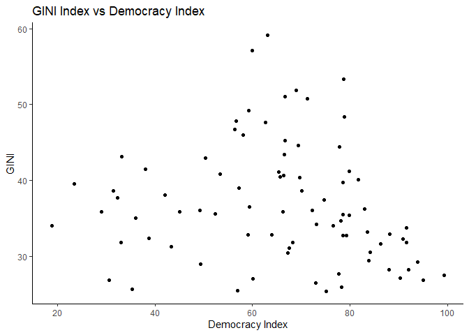

Does Democratic Freedom Correlate With Income Inequality?
================

- [Introduction](#introduction)
- [Regression Analysis](#regression-analysis)
- [Discussion](#discussion)
- [Limitations](#limitations)
- [Conclusion](#conclusion)
- [Additional Work](#additional-work)
- [References](#references)

## Introduction

In recent years inequality has taken greater importance within the
spectrum of economic issues. The financial crisis and the Occupy Wall
Street movement that followed were indicators of inequality as a growing
issue for everyday Americans. Furthermore, Thomas Piketty released
*Capital in the Twenty-First Century*, a work that ended up reaching the
mainstream and commented on the growing wealth disparity worldwide. Even
in the American political sphere, income and wealth inequality has
become a defining issue. In a speech given during his time as an
economic advisor for the Obama administration, Alan B. Krueger stated
that “the rise in inequality in the United States over the last three
decades has reached the point that inequality in incomes is causing an
unhealthy division in opportunities, and is a threat to our economic
growth” (Krueger, 2012). What has led to the rise in inequality is still
up for debate.

Currently, “the richest 10% of the global population currently takes 52%
of global income, whereas the poorest half of the population earns 8.5%
of it” (Chancel, Piketty, Saez, & Zucman, 2022). A multitude of factors
may be related to this increased economic polarization. Economic policy
is one such factor. The free market economic policies which followed the
economic slowdown of the 70s have been cited as one potential cause. As
Chancel, Piketty, Saez, and Zucman commented in their paper, “the
institutions that kept inequality low (minimum wage, union, taxes,
regulation, etc.) were to blame, and that what we needed was to unleash
an entrepreneurial culture that celebrates the unabashed accumulation of
private wealth” (Chancel, Piketty, Saez, & Zucman, 2022). Innovations in
technology are also potential culprits (Jones, 2015) and of course,
union membership, tax policy, and health also all play a potential role
in the establishment of income inequality. However, it is unlikely that
one specific factor drives income inequality and all the previously
stated factors relate back to governmental institutions. Piketty
summarized this neatly in an interview where he discussed the concept of
the “inequality regime”, or “the justification \[used\] for the
structure of inequality and also the institutions — the legal system,
the educational system, the fiscal system — that help sustain a certain
level of equality or inequality in a given society” (Pazzanese, 2020).
If inequality regimes perpetuate inequality, then one would expect the
voting citizens of nations to attempt to dismantle these regimes through
the democratic process. Yet, this has not occurred, and Piketty even
argues that “political platforms … have become less and less concerned
with inequality and redistribution (Pazzanese 2020). When changes aren’t
being made in the favor of the working class, governmental systems may
be of significant impact, because when people don’t have the democratic
freedom to advocate for the policies and candidates which may dismantle
institutionally driven inequality then inequality regimes are able to
prosper. So, a lack of democratic freedom may be a potential cause of
global inequality. This hypothesis leads to the main question of this
paper. Is there a correlation between democratic freedoms and income
inequality?

**Data:**

Most of the data used in this report comes from the World Bank and its
World Development Indicators database. This data is compiled by the
World Bank from a variety of official government sources and is
continuously updated (Data Bank World Development Indicators, 2022). The
variables in the report that come from this database include GDP Per
Capita (Current US\$), Gini Index, Income Share held the by highest 10%,
Trade (% of GDP), Life expectancy at birth for females (years),
secondary education duration (years), and final government expenditure
as a percentage of GDP. The other significant data source was the
Gapminder database (Gapminder, n.d.). Gapminder is a Swedish
organization that promotes what it calls a fact-based worldview. It has
a vast database that contains much of the same data the World Bank
database contains, with a few other sources. For this report, the
Democracy Index data were taken from the Gapminder database. Only data
from the year 2015 is being used. Recent years don’t have enough data to
work with and 2015 has many countries with Gini data available. There
are 83 countries represented in the analysis. The democracy index is a
numerical score for the state of a country’s democracy. It is based on
five measures: “electoral process and pluralism, the functioning of
government, political participation, democratic political culture and
civil liberties” (A new low for global democracy, 2022). The score
ranges from zero to 100 with 100 being the most democratic. The index is
compiled by EIU, the research arm of The Economist. The Gini index is
one of the measures of income inequality being used in this report. This
variable is one of the response variables of the model. As defined by
the World Bank the Gini measures “the extent to which the distribution
of income or consumption among individuals or households within an
economy deviates from a perfectly equal distribution. A Gini index of 0
represents perfect equality, while an index of 100 implies perfect
inequality” (The World Bank, n.d.). The figure below illustrates the
distribution of the Gini data when plotted with the Democracy Index.

<figure>

<figcaption aria-hidden="true">Figure 1. Gini Index vs Democracy
Index</figcaption>
</figure>

``` r
cor(wdi$DemocracyIndex,wdi$GINI, use = "complete.obs")
```

    ## [1] -0.1498364

Democracy Index and Gini correlation: -0.2509

The scatterplot of Gini and the Democracy Index illustrates a weak
correlation between Gini and the Democracy Index with the data spread in
a broad range.

The second measure of inequality which functions as an alternative to
Gini is the income share held by the top 10% of earners. This is a
slightly different measure of inequality in that it centered more on the
concentration of wealth at the top, and not the distribution of wealth
across the population. The figure below illustrates a very similar
distribution in comparison to the Gini index.

<figure>

<figcaption aria-hidden="true">Figure 2. Percentage of income held by
top 10% vs Democracy Index</figcaption>
</figure>

``` r
cor(wdi$DemocracyIndex,wdi$TenpercentShare, use = "complete.obs")
```

    ## [1] -0.1740625

Correlation: -0.2754291

The figure shows a potential negative correlation, but it is hard to
tell from the figure alone. The correlation coefficient illustrates a
slight negative correlation. The two variables are correlated to a high
degree, but the negative aspect hold in line with the hypothesis of the
paper.

The other explanatory variables which are included in the data used for
this report are control variables. The reasoning for including them in
the model will be detailed in the next section of the report.

## Regression Analysis

There are two main aspects to this modeling process. The first is the
establishment of both the response and key explanatory variables, the
second is the selection of control variables. I perform two regressions
with different measures of inequality as the response variable. The Gini
index functions as a widely used metric, that evaluates the distribution
of income, so it made sense to choose it as a key responsive variable in
the model. The percentage of income held by the top 10% of earners is
the other response variable utilized in the second version of the model.
This allows for comparison between measures of income inequality. The
democratic freedom index is the explanatory variable of interest.

The complexity of income inequality makes it necessary to include a
significant amount of control variables in the final model. Prior models
offer a guide for what to include. One widely cited study done by the
IMF (Dabla-Norris, Kochhar, Ricka, Suphaphiphat, & Tsounta, 2015)
includes a multitude of control variables, some of which were also used
in this report including trade, education, and government spending.
Equation 1 shows the full model, where the observational unit is
countries.

Equation 1. Democracy Index Model

*inequality<sub>2015</sub> = =β<sub>0</sub> trade +β<sub>1</sub>
Education + β<sub>2</sub> GovExp + β<sub>3</sub> GDP + β<sub>4</sub>
Democracy Index*

Where *inequality* is either of the two measures of inequality
previously discussed: the Gini index and the income share of the highest
10% of earners. *Trade* is the sum of imports and exports as a
percentage of GDP, *Education* is the duration of secondary education in
years. Education relates to both inequality and democratic freedom
because theoretically, a more educated populace would be less irrational
when voting. Furthermore, as already discussed it was included in past
studies looking at drivers of inequality, so it functions as a control.
*GovExp* represents the general government final consumption expenditure
as a % of GDP. One would expect higher government spending to mean
greater taxation of the rich and more government programs which would
decrease inequality. *GDP* is also a control variable. As already
stated, the time frame of this data and the model is 2015. No variable
transformations occurred, there were no obvious transformations that
needed to be made when examining the data prior to creating the model.

**Final Model Outputs**

``` r
inequality_reg = lm(GINI ~ Trade +  LifeExpectancy +
                      Education_Years + GovExp + DemocracyIndex + Union, data = wdi)
summary(inequality_reg)
```

    ## 
    ## Call:
    ## lm(formula = GINI ~ Trade + LifeExpectancy + Education_Years + 
    ##     GovExp + DemocracyIndex + Union, data = wdi)
    ## 
    ## Residuals:
    ##      Min       1Q   Median       3Q      Max 
    ## -10.8319  -3.8169  -0.8639   3.7597  12.6422 
    ## 
    ## Coefficients:
    ##                  Estimate Std. Error t value Pr(>|t|)    
    ## (Intercept)     88.582347  11.418692   7.758 1.56e-10 ***
    ## Trade           -0.009358   0.013591  -0.689 0.493877    
    ## LifeExpectancy  -0.508537   0.182787  -2.782 0.007275 ** 
    ## Education_Years -2.211659   0.774972  -2.854 0.005980 ** 
    ## GovExp          -0.028475   0.190816  -0.149 0.881890    
    ## DemocracyIndex   0.109318   0.066698   1.639 0.106625    
    ## Union           -0.165521   0.045868  -3.609 0.000642 ***
    ## ---
    ## Signif. codes:  0 '***' 0.001 '**' 0.01 '*' 0.05 '.' 0.1 ' ' 1
    ## 
    ## Residual standard error: 5.708 on 58 degrees of freedom
    ##   (18 observations deleted due to missingness)
    ## Multiple R-squared:  0.4733, Adjusted R-squared:  0.4188 
    ## F-statistic: 8.685 on 6 and 58 DF,  p-value: 9.462e-07

``` r
inequality_reg2 = lm(TenpercentShare ~ Trade +  LifeExpectancy +
                      Education_Years + GovExp + DemocracyIndex + Union, data = wdi)
summary(inequality_reg2)
```

    ## 
    ## Call:
    ## lm(formula = TenpercentShare ~ Trade + LifeExpectancy + Education_Years + 
    ##     GovExp + DemocracyIndex + Union, data = wdi)
    ## 
    ## Residuals:
    ##    Min     1Q Median     3Q    Max 
    ## -6.044 -1.980 -0.670  2.073  9.877 
    ## 
    ## Coefficients:
    ##                  Estimate Std. Error t value Pr(>|t|)    
    ## (Intercept)     75.131335   7.720972   9.731 8.45e-14 ***
    ## Trade           -0.006969   0.009190  -0.758 0.451348    
    ## LifeExpectancy  -0.468322   0.123595  -3.789 0.000362 ***
    ## Education_Years -1.945720   0.524013  -3.713 0.000462 ***
    ## GovExp          -0.035932   0.129024  -0.278 0.781628    
    ## DemocracyIndex   0.094370   0.045099   2.093 0.040780 *  
    ## Union           -0.107893   0.031015  -3.479 0.000962 ***
    ## ---
    ## Signif. codes:  0 '***' 0.001 '**' 0.01 '*' 0.05 '.' 0.1 ' ' 1
    ## 
    ## Residual standard error: 3.86 on 58 degrees of freedom
    ##   (18 observations deleted due to missingness)
    ## Multiple R-squared:  0.5587, Adjusted R-squared:  0.5131 
    ## F-statistic: 12.24 on 6 and 58 DF,  p-value: 7.615e-09

An initial analysis of the model indicates that both models are
statistically significant based on the F-statistic. Both have p-values
that are virtually zero indicating high significance. The adjusted
r-squared of 0. 297 for the Gini model indicates that 29.7% of the
variability observed in the response variable is explained by the model.
The regression using income held by the top 10% has a slightly higher
r-squared value of 0.3412 indicating that 34% of the variability in the
response variable is explained by the model.

Looking further at the Gini-based model it is apparent that there are
varying degrees of significance between the coefficients in the model.
*Trade* has a p-value of 0.22 so it is not statistically significant.
*Education* is significant within an alpha of virtually 0. *GovExp* is
not statistically significant. The *DemocracyIndex* variable is not
statistically significant.

Examining the model based on income held by the top 10% reveals slightly
different significance. *Education* has a high level of significance
with a p-value of 0.0000341. The *DemocracyIndex* still has no level of
significance.

The coefficient for the Democracy Index is .08215 in the Gini model and
0.04871 in the top 10% model. This would indicate that for every
increase in 1 unit of the Democracy Index, the Gini or percentage of
income held by the top 10% increases by a unit of .08215 and .049%
respectively.

## Discussion

The first conclusion to make according to this model is that, with
respect to both response variables, democratic freedom is not a
statistically significant driver of income inequality. When comparing
the significance of the Democracy Index variable to other control
variables in the model it appears that education and GDP are the more
significant drivers in comparison to democratic freedoms. It should also
be noted that the Democracy Index took on more significance when the
income held by the top 10% was used as the measure of inequality. But in
both models, the Democracy Index did not reach a significance level
within an alpha of 0.05.

Furthermore, the coefficient values for the Democracy Index variable
were positive in both versions of the model. The positivity is
interesting because it would indicate that as democratic freedom
increases inequality potentially increases, which does not match the
theoretical assumption of the paper. One would expect that countries
with greater democracy would have greater equality. The model may suffer
from omitted variable bias and multicollinearity, which would lead to
biased results. Ideally, we would see greater significance within the
model to make a claim about correlation. This lack of conclusive
understanding is furthered by the fact that multiple other variables in
the model have higher levels of significance. Furthermore, no claims of
causality can be made from this report given the nature of the
statistical analysis. But democratic freedom does not correlate with
inequality in any significant way. The conclusion section later in the
paper further speculates why there is no correlation shown in the
models.

To establish any causality a well-designed experiment would need to be
performed that isolated democratic freedoms from other causes of
inequality. This is virtually impossible in the real world but ideally,
disregarding any ethical considerations, an experiment could be set up
where people are randomly assigned to different countries of varying
levels of democracy and then the level of income inequality is measured
in each country. This could better establish a link between democratic
freedoms and income inequality.

## Limitations

One limitation of this study was the lack of availability of data for
inequality statistics. Not many countries had Gini data available in the
same years, limiting the pool of data points to work from. Eighty-three
plus countries is still a fine sample size but more countries would have
given better data and a more concrete conclusion. More countries may
have led to a completely different conclusion. Another significant
limitation was the availability of data for certain control variables I
was interested in including in the model. The most significant of these
would be a measure of technological inequality. In my data set, there
were no strong examples of a variable that might indicate technological
inequality which is unfortunate given the academic literature on the
importance of technology in driving the division of capital and income
inequality.

The last significant limitation was the measure used for democratic
freedom. The Democracy Index comes from a reputable source and does an
effective job of accomplishing the goal of the organization, but it
might not be the most effective measure of democratic freedom, and it
may not be specific enough to the actual institutional causes of
inequality. One potential issue with the Index is that it does not seem
to include much information regarding the effects of monetary
contribution and special interests in its model. Theoretically, special
interest groups sway democracies in favor of businesses and the wealthy
so it would be ideal to have a measure that also includes that kind of
information in its model. An ideal measure would also include more labor
rights information in its model.

## Conclusion

The model shows no correlation between an index that measures democratic
freedom and income inequality. Taking the model to be accurate, this
result reveals that other factors play greater roles in determining
economic inequality. One might expect that if countries have greater
democratic systems, the constituents of the governing body would vote
for candidates and measures which evened the economic playing field.
This seems to be the case in certain countries like Norway and Finland
which have very low levels of inequality and high levels of democracy.
Many countries which have what the index calls “flawed democracies,”
have a range of Gini indexes. Some have Gini’s that outperform their
democracy scores while others, like the United States, have Gini’s that
under perform their scores relative to other nations. Perhaps the
individual culture of nations is a determining factor in the policies
passed, and therefore the levels of inequality. Furthermore, it seems
possible that populism and other political movements have impacted the
importance of income inequality to voters in many nations. These are
paths of study that could be taken in the future.

In addition, future work might include the additional study of tax law
and corporate lobbying. Previous academic work regarding wealth
inequality has centered around historical tax income and the
inequalities that arise. The topic of corporate lobbying and spending
seems to have been somewhat neglected. Further research into the impact
of corporate lobbying on tax policy, labor rights, and income
inequality, in general, may reveal greater results regarding actual
drivers of income inequality.

## Additional Work

**Additional descriptive data:**

``` r
summary(wdi)
```

    ##       Time       Time Code         Country Name       Country Code      
    ##  Min.   :2015   Length:83          Length:83          Length:83         
    ##  1st Qu.:2015   Class :character   Class :character   Class :character  
    ##  Median :2015   Mode  :character   Mode  :character   Mode  :character  
    ##  Mean   :2015                                                           
    ##  3rd Qu.:2015                                                           
    ##  Max.   :2015                                                           
    ##                                                                         
    ##       GDP                GINI           Trade             CO2         
    ##  Min.   :   570.9   Min.   :25.40   Min.   : 21.33   Min.   :0.07149  
    ##  1st Qu.:  3656.4   1st Qu.:31.70   1st Qu.: 52.97   1st Qu.:0.13486  
    ##  Median :  8814.0   Median :35.90   Median : 80.18   Median :0.18047  
    ##  Mean   : 17601.6   Mean   :36.83   Mean   : 89.81   Mean   :0.20618  
    ##  3rd Qu.: 22149.2   3rd Qu.:40.95   3rd Qu.:110.17   3rd Qu.:0.24734  
    ##  Max.   :105462.0   Max.   :59.10   Max.   :351.13   Max.   :0.55410  
    ##                                     NA's   :1                         
    ##  LifeExpectancy      GovExp       Education_Years GovExp_Education
    ##  Min.   :53.97   Min.   : 5.935   Min.   :4.000   Min.   :2.100   
    ##  1st Qu.:75.73   1st Qu.:13.099   1st Qu.:6.000   1st Qu.:3.768   
    ##  Median :78.90   Median :16.960   Median :6.000   Median :4.744   
    ##  Mean   :77.53   Mean   :16.682   Mean   :6.566   Mean   :4.798   
    ##  3rd Qu.:82.75   3rd Qu.:19.528   3rd Qu.:7.000   3rd Qu.:5.514   
    ##  Max.   :85.70   Max.   :31.528   Max.   :9.000   Max.   :9.851   
    ##                                                   NA's   :10      
    ##        r          TenpercentShare DemocracyIndex  Freedom Index  
    ##  Min.   : 2.681   Min.   :20.90   Min.   :18.90   Min.   :1.000  
    ##  1st Qu.: 5.154   1st Qu.:24.80   1st Qu.:56.40   1st Qu.:1.000  
    ##  Median : 9.129   Median :27.50   Median :67.35   Median :2.000  
    ##  Mean   :11.161   Mean   :28.70   Mean   :65.43   Mean   :2.669  
    ##  3rd Qu.:15.748   3rd Qu.:31.65   3rd Qu.:78.67   3rd Qu.:4.000  
    ##  Max.   :43.958   Max.   :47.30   Max.   :99.30   Max.   :6.500  
    ##  NA's   :31                       NA's   :1                      
    ##    FundRights        Union       idea_democracy 
    ##  Min.   :34.90   Min.   : 1.00   Min.   : 0.00  
    ##  1st Qu.:55.55   1st Qu.:11.79   1st Qu.: 2.21  
    ##  Median :67.35   Median :19.16   Median :13.65  
    ##  Mean   :67.61   Mean   :24.34   Mean   :17.70  
    ##  3rd Qu.:84.10   3rd Qu.:30.49   3rd Qu.:25.10  
    ##  Max.   :95.60   Max.   :86.20   Max.   :86.90  
    ##  NA's   :3       NA's   :18      NA's   :3

<!-- --><!-- --><!-- --><!-- --><!-- --><!-- --><!-- --><!-- --><!-- --><!-- --><!-- -->

Table of Correlations

|                |       GINI |      Trade | LifeExpectancy |     GovExp | DemocracyIndex |      Union |
|:---------------|-----------:|-----------:|---------------:|-----------:|---------------:|-----------:|
| GINI           |  1.0000000 | -0.2904470 |     -0.4372532 | -0.3264924 |     -0.2509549 | -0.5108409 |
| Trade          | -0.2904470 |  1.0000000 |      0.3277423 |  0.1894038 |      0.3244862 |  0.2522433 |
| LifeExpectancy | -0.4372532 |  0.3277423 |      1.0000000 |  0.4228151 |      0.7514410 |  0.3220306 |
| GovExp         | -0.3264924 |  0.1894038 |      0.4228151 |  1.0000000 |      0.4579390 |  0.4796795 |
| DemocracyIndex | -0.2509549 |  0.3244862 |      0.7514410 |  0.4579390 |      1.0000000 |  0.3715838 |
| Union          | -0.5108409 |  0.2522433 |      0.3220306 |  0.4796795 |      0.3715838 |  1.0000000 |

**Alternative Model:**

Equation 2. Democracy Index Model with GDP included

*inequality<sub>2015</sub> = =β<sub>0</sub> trade +β<sub>1</sub>
LifeExpectancy + β<sub>2</sub> Education + β<sub>3</sub> GovExp +
β<sub>4</sub> Union + β<sub>5</sub>DemocracyIndex + β<sub>6</sub>GDP*

``` r
# alternative model 1
inequality_reg3 = lm(GINI ~ LifeExpectancy + Trade + GDP +
                       Education_Years + GovExp + DemocracyIndex + Union, data = wdi)
summary(inequality_reg3)
```

    ## 
    ## Call:
    ## lm(formula = GINI ~ LifeExpectancy + Trade + GDP + Education_Years + 
    ##     GovExp + DemocracyIndex + Union, data = wdi)
    ## 
    ## Residuals:
    ##     Min      1Q  Median      3Q     Max 
    ## -9.7438 -3.8775 -0.5073  4.0455 12.1858 
    ## 
    ## Coefficients:
    ##                   Estimate Std. Error t value Pr(>|t|)    
    ## (Intercept)      8.189e+01  1.182e+01   6.929 4.18e-09 ***
    ## LifeExpectancy  -4.535e-01  1.821e-01  -2.491  0.01568 *  
    ## Trade           -3.672e-03  1.372e-02  -0.268  0.78986    
    ## GDP             -8.639e-05  4.835e-05  -1.787  0.07932 .  
    ## Education_Years -2.273e+00  7.615e-01  -2.985  0.00418 ** 
    ## GovExp          -4.410e-02  1.875e-01  -0.235  0.81492    
    ## DemocracyIndex   1.633e-01  7.212e-02   2.265  0.02734 *  
    ## Union           -1.432e-01  4.672e-02  -3.066  0.00331 ** 
    ## ---
    ## Signif. codes:  0 '***' 0.001 '**' 0.01 '*' 0.05 '.' 0.1 ' ' 1
    ## 
    ## Residual standard error: 5.603 on 57 degrees of freedom
    ##   (18 observations deleted due to missingness)
    ## Multiple R-squared:  0.5012, Adjusted R-squared:  0.4399 
    ## F-statistic: 8.182 on 7 and 57 DF,  p-value: 7.208e-07

``` r
# alternative model 2
inequality_reg4 = lm(GINI ~ LifeExpectancy + Trade +
                       Education_Years + GovExp + DemocracyIndex, data = wdi)

summary(inequality_reg4)
```

    ## 
    ## Call:
    ## lm(formula = GINI ~ LifeExpectancy + Trade + Education_Years + 
    ##     GovExp + DemocracyIndex, data = wdi)
    ## 
    ## Residuals:
    ##      Min       1Q   Median       3Q      Max 
    ## -12.8841  -4.8654  -0.7549   3.8189  14.8853 
    ## 
    ## Coefficients:
    ##                 Estimate Std. Error t value Pr(>|t|)    
    ## (Intercept)     84.33808    9.87288   8.542 1.11e-12 ***
    ## LifeExpectancy  -0.39952    0.14878  -2.685  0.00892 ** 
    ## Trade           -0.02630    0.01506  -1.747  0.08478 .  
    ## Education_Years -2.59996    0.80359  -3.235  0.00181 ** 
    ## GovExp          -0.02784    0.17894  -0.156  0.87678    
    ## DemocracyIndex   0.05184    0.05791   0.895  0.37353    
    ## ---
    ## Signif. codes:  0 '***' 0.001 '**' 0.01 '*' 0.05 '.' 0.1 ' ' 1
    ## 
    ## Residual standard error: 6.668 on 75 degrees of freedom
    ##   (2 observations deleted due to missingness)
    ## Multiple R-squared:  0.3183, Adjusted R-squared:  0.2728 
    ## F-statistic: 7.003 on 5 and 75 DF,  p-value: 2.037e-05

## References

*A new low for global democracy*. (2022, February 9). Retrieved from The
Economist.

*About* . (n.d.). Retrieved from The Global State of Democracy Indices :
<https://www.idea.int/gsod-indices/about#Fundamental%20Rights>

Chancel, L., Piketty, T., Saez, E., & Zucman, G. (2022). *World
Inequality Report 2022.* World Inequality Lab.

Dabla-Norris, E., Kochhar, K., Ricka, F., Suphaphiphat, N., & Tsounta,
E. (2015). *Causes and Consequences of Income Inequality: A global
perspective.* International Monetary Fund.

*Data Bank World Development Indicators*. (2022, November 19). Retrieved
from The World Bank.

Gapminder (n.d.). *Download the data*. Retrieved from Gapminder:
<https://www.gapminder.org/data/>

Jones, C. I. (2015). Pareto and Piketty: The Macroeconomics of Top
Income and Wealth Inequality. *Journal of Economic Perspectives*, 29-46.

Krueger, A. (2012, January 12). *The Rise and Consequences of
Inequality.* Retrieved from The Center for American Progress:
<https://www.americanprogress.org/events/the-rise-and-consequences-of-inequality/>

Pazzanese, C. (2020, March 3). *How political ideas keep economic
inequality going*. Retrieved from The Harvard Gazette:
<https://news.harvard.edu/gazette/story/2020/03/pikettys-new-book-explores-how-economic-inequality-is-perpetuated/>

The World Bank. (n.d.). *Metadata Glossary*. Retrieved from The World
Bank.
