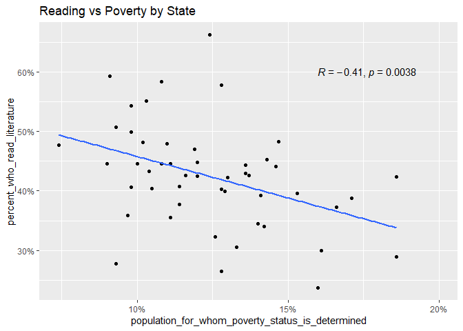
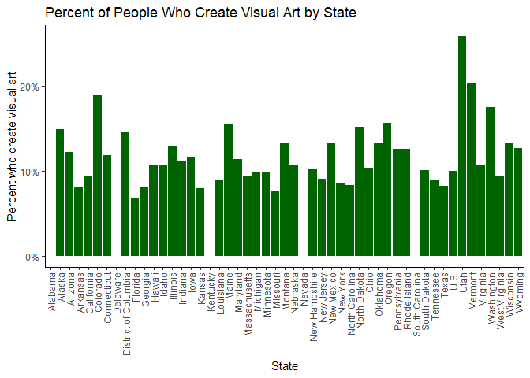
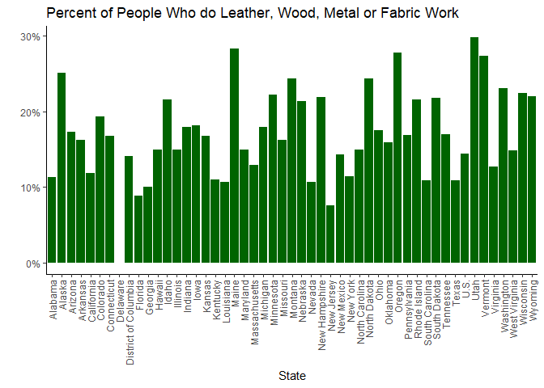
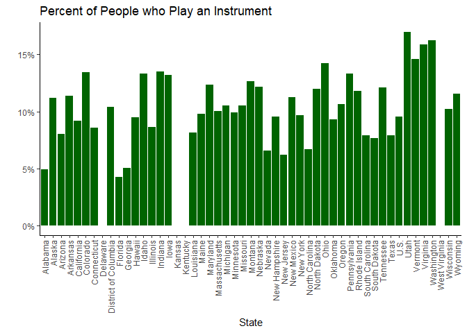
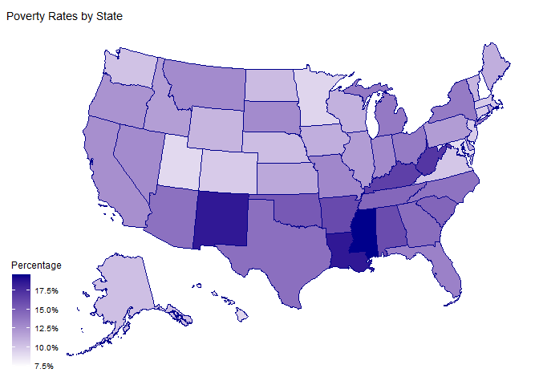
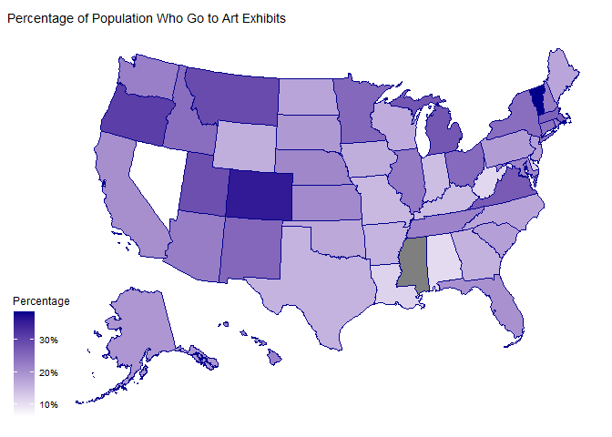
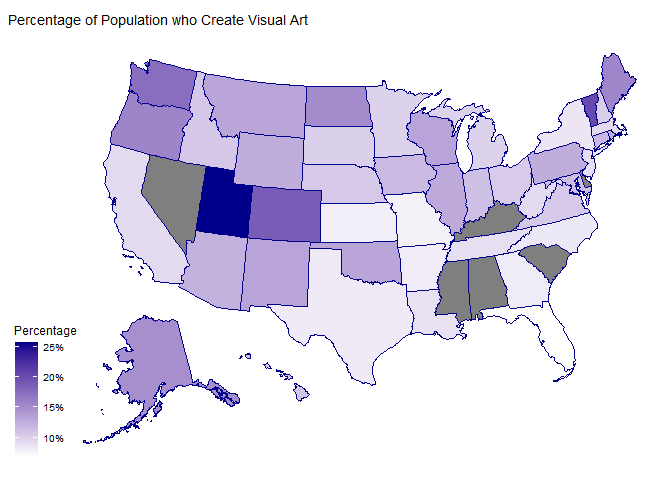
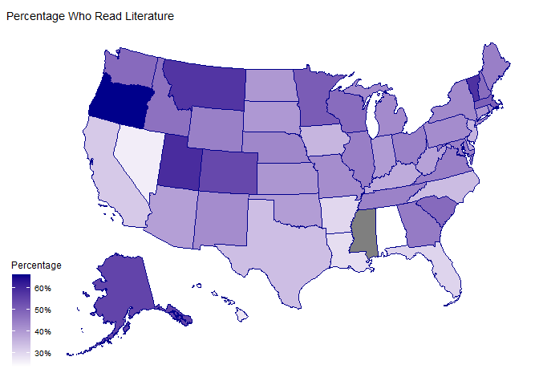

Poverty and Art at the State Level
================

# Introduction

This project utilizes poverty data from the U.S. Census database, coded:
ACSST5Y2020.S1701. Additionally, I utilized data from 2020 National
Endowment for the Arts Basic Survey:
<https://www.arts.gov/impact/research/arts-data-profile-series/adp-32>.
This data surveys art creation and consumption in its different forms
across all the U.S. states.

The goal of this project is to gain further experience cleaning,
manipulating and analyzing data; and to present a general analysis of
poverty in the US and how it relates to the state of “The Arts”, broadly
speaking.

This README presents a broad survey of some of the analysis from this
project. It is not supposed to be a formal analysis of the data sets,
just a look at the data and some interesting visualizations.

For a complete look at how I processed the data used in this project,
please reference the R script in this projects folder.

# Analysis and Data Visualizations

#### Poverty rate by state (including Puerto Rico)

| state                | population_for_whom_poverty_status_is_determined |
|:---------------------|-------------------------------------------------:|
| Puerto Rico          |                                            0.434 |
| Mississippi          |                                            0.196 |
| Louisiana            |                                            0.186 |
| New Mexico           |                                            0.186 |
| West Virginia        |                                            0.171 |
| Kentucky             |                                            0.166 |
| Arkansas             |                                            0.161 |
| Alabama              |                                            0.160 |
| District Of Columbia |                                            0.155 |
| Oklahoma             |                                            0.153 |
| South Carolina       |                                            0.147 |
| Tennessee            |                                            0.146 |
| Georgia              |                                            0.143 |
| Texas                |                                            0.142 |
| Arizona              |                                            0.141 |
| North Carolina       |                                            0.140 |
| Michigan             |                                            0.137 |
| New York             |                                            0.136 |
| Ohio                 |                                            0.136 |
| Florida              |                                            0.133 |
| Missouri             |                                            0.130 |
| Indiana              |                                            0.129 |
| Montana              |                                            0.128 |
| Nevada               |                                            0.128 |
| South Dakota         |                                            0.128 |
| California           |                                            0.126 |
| Oregon               |                                            0.124 |
| Illinois             |                                            0.120 |
| Pennsylvania         |                                            0.120 |
| Idaho                |                                            0.119 |
| Rhode Island         |                                            0.116 |
| Delaware             |                                            0.114 |
| Kansas               |                                            0.114 |
| Iowa                 |                                            0.111 |
| Maine                |                                            0.111 |
| Wisconsin            |                                            0.110 |
| Vermont              |                                            0.108 |
| Wyoming              |                                            0.108 |
| North Dakota         |                                            0.105 |
| Nebraska             |                                            0.104 |
| Alaska               |                                            0.103 |
| Washington           |                                            0.102 |
| Virginia             |                                            0.100 |
| Colorado             |                                            0.098 |
| Connecticut          |                                            0.098 |
| Massachusetts        |                                            0.098 |
| New Jersey           |                                            0.097 |
| Hawaii               |                                            0.093 |
| Minnesota            |                                            0.093 |
| Utah                 |                                            0.091 |
| Maryland             |                                            0.090 |
| New Hampshire        |                                            0.074 |

#### Percentage of people below poverty line who did not graduate high school

| state                | less_than_high_school_graduate |
|:---------------------|-------------------------------:|
| Puerto Rico          |                          0.616 |
| District Of Columbia |                          0.347 |
| Kentucky             |                          0.326 |
| Louisiana            |                          0.323 |
| Mississippi          |                          0.314 |
| New Mexico           |                          0.314 |
| West Virginia        |                          0.306 |
| Alabama              |                          0.285 |
| South Dakota         |                          0.285 |
| South Carolina       |                          0.280 |
| Michigan             |                          0.276 |
| New York             |                          0.274 |
| Ohio                 |                          0.273 |
| Tennessee            |                          0.273 |
| North Carolina       |                          0.268 |
| Missouri             |                          0.260 |
| Oklahoma             |                          0.259 |
| Georgia              |                          0.258 |
| Arkansas             |                          0.257 |
| Vermont              |                          0.255 |
| Montana              |                          0.246 |
| Arizona              |                          0.245 |
| Rhode Island         |                          0.245 |
| Florida              |                          0.242 |
| Pennsylvania         |                          0.241 |
| Maine                |                          0.239 |
| Texas                |                          0.239 |
| Connecticut          |                          0.238 |
| Indiana              |                          0.235 |
| Massachusetts        |                          0.232 |
| Minnesota            |                          0.226 |
| New Jersey           |                          0.220 |
| Wisconsin            |                          0.220 |
| Kansas               |                          0.219 |
| Illinois             |                          0.218 |
| Oregon               |                          0.218 |
| Iowa                 |                          0.213 |
| Virginia             |                          0.212 |
| Alaska               |                          0.210 |
| California           |                          0.208 |
| Nebraska             |                          0.208 |
| North Dakota         |                          0.208 |
| Washington           |                          0.205 |
| Wyoming              |                          0.205 |
| Delaware             |                          0.202 |
| Nevada               |                          0.195 |
| Idaho                |                          0.194 |
| Maryland             |                          0.194 |
| New Hampshire        |                          0.193 |
| Colorado             |                          0.190 |
| Utah                 |                          0.171 |
| Hawaii               |                          0.170 |

#### High school graduation rates

| state | population_for_whom_poverty_status_is_determined | less_than_high_school_graduate | non_highschool_per_population |
|:---|---:|---:|---:|
| Puerto Rico | 3227457 | 515862 | 0.1598354 |
| California | 38589882 | 4181094 | 0.1083469 |
| Texas | 28013446 | 2786400 | 0.0994665 |
| Mississippi | 2883074 | 271922 | 0.0943167 |
| Louisiana | 4532187 | 416601 | 0.0919205 |
| Nevada | 2987817 | 268353 | 0.0898157 |
| New Mexico | 2053909 | 184013 | 0.0895916 |
| New York | 19009098 | 1685474 | 0.0886667 |
| Alabama | 4771614 | 418279 | 0.0876599 |
| West Virginia | 1755591 | 152246 | 0.0867207 |
| Kentucky | 4322881 | 371057 | 0.0858356 |
| Arkansas | 2923585 | 249503 | 0.0853415 |
| Florida | 20793628 | 1683580 | 0.0809661 |
| Arizona | 7012999 | 565859 | 0.0806872 |
| South Carolina | 4950181 | 392312 | 0.0792521 |
| Georgia | 10238369 | 809239 | 0.0790398 |
| Tennessee | 6603468 | 521652 | 0.0789967 |
| North Carolina | 10098330 | 787383 | 0.0779716 |
| Rhode Island | 1017028 | 77201 | 0.0759084 |
| Oklahoma | 3833712 | 284646 | 0.0742481 |
| Indiana | 6491632 | 455587 | 0.0701807 |
| Illinois | 12418504 | 857230 | 0.0690284 |
| New Jersey | 8713792 | 580340 | 0.0666002 |
| Virginia | 8255575 | 539195 | 0.0653128 |
| Delaware | 941266 | 60508 | 0.0642836 |
| Maryland | 5894835 | 378181 | 0.0641546 |
| Missouri | 5942813 | 374117 | 0.0629528 |
| Massachusetts | 6637329 | 414998 | 0.0625248 |
| Connecticut | 3466935 | 216287 | 0.0623857 |
| Oregon | 4096744 | 255149 | 0.0622809 |
| Pennsylvania | 12387061 | 768604 | 0.0620489 |
| Ohio | 11350378 | 702230 | 0.0618684 |
| Michigan | 9753541 | 576565 | 0.0591134 |
| District Of Columbia | 669089 | 38913 | 0.0581582 |
| Washington | 7372433 | 422169 | 0.0572632 |
| Idaho | 1722972 | 97665 | 0.0566840 |
| Kansas | 2828498 | 157906 | 0.0558268 |
| Nebraska | 1869467 | 101495 | 0.0542909 |
| Colorado | 5563823 | 298388 | 0.0536300 |
| Hawaii | 1381577 | 72866 | 0.0527412 |
| Wisconsin | 5659485 | 283170 | 0.0500346 |
| South Dakota | 849910 | 42248 | 0.0497088 |
| Iowa | 3051284 | 151642 | 0.0496978 |
| Maine | 1304038 | 63838 | 0.0489541 |
| New Hampshire | 1312770 | 62485 | 0.0475978 |
| Vermont | 599938 | 27516 | 0.0458647 |
| Alaska | 719445 | 32169 | 0.0447136 |
| Minnesota | 5476956 | 242833 | 0.0443372 |
| North Dakota | 735842 | 31951 | 0.0434210 |
| Wyoming | 566858 | 24124 | 0.0425574 |
| Utah | 3102049 | 128471 | 0.0414149 |
| Montana | 1036490 | 42132 | 0.0406487 |

#### Poverty rates by race

| state | white_alone | black_or_african_american_alone | american_indian_and_alaska_native_alone | asian_alone | native_hawaiian_and_other_pacific_islander_alone | some_other_race_alone | two_or_more_races | hispanic_or_latino_origin_of_any_race | white_alone_not_hispanic_or_latino |
|:---|---:|---:|---:|---:|---:|---:|---:|---:|---:|
| Alabama | 0.117 | 0.256 | 0.186 | 0.133 | 0.156 | 0.327 | 0.212 | 0.292 | 0.112 |
| Alaska | 0.072 | 0.111 | 0.241 | 0.092 | 0.166 | 0.082 | 0.105 | 0.103 | 0.071 |
| Arizona | 0.122 | 0.197 | 0.315 | 0.115 | 0.152 | 0.205 | 0.155 | 0.192 | 0.096 |
| Arkansas | 0.131 | 0.286 | 0.212 | 0.115 | 0.263 | 0.245 | 0.190 | 0.224 | 0.127 |
| California | 0.114 | 0.196 | 0.184 | 0.100 | 0.122 | 0.173 | 0.117 | 0.162 | 0.088 |
| Colorado | 0.089 | 0.168 | 0.179 | 0.100 | 0.119 | 0.144 | 0.130 | 0.148 | 0.077 |
| Connecticut | 0.074 | 0.175 | 0.188 | 0.088 | 0.126 | 0.252 | 0.126 | 0.210 | 0.059 |
| Delaware | 0.088 | 0.176 | 0.155 | 0.114 | 0.091 | 0.213 | 0.166 | 0.184 | 0.080 |
| District Of Columbia | 0.060 | 0.242 | 0.341 | 0.137 | 0.039 | 0.150 | 0.115 | 0.121 | 0.056 |
| Florida | 0.115 | 0.207 | 0.162 | 0.119 | 0.161 | 0.187 | 0.139 | 0.164 | 0.097 |
| Georgia | 0.107 | 0.201 | 0.246 | 0.104 | 0.212 | 0.230 | 0.165 | 0.210 | 0.098 |
| Hawaii | 0.095 | 0.084 | 0.212 | 0.060 | 0.210 | 0.068 | 0.092 | 0.121 | 0.091 |
| Idaho | 0.111 | 0.243 | 0.257 | 0.154 | 0.346 | 0.192 | 0.142 | 0.190 | 0.104 |
| Illinois | 0.091 | 0.252 | 0.135 | 0.104 | 0.116 | 0.158 | 0.135 | 0.146 | 0.083 |
| Indiana | 0.107 | 0.269 | 0.182 | 0.163 | 0.118 | 0.222 | 0.195 | 0.202 | 0.103 |
| Iowa | 0.098 | 0.308 | 0.227 | 0.143 | 0.326 | 0.187 | 0.203 | 0.193 | 0.093 |
| Kansas | 0.098 | 0.239 | 0.190 | 0.147 | 0.092 | 0.203 | 0.175 | 0.181 | 0.091 |
| Kentucky | 0.154 | 0.266 | 0.263 | 0.146 | 0.186 | 0.280 | 0.230 | 0.244 | 0.152 |
| Louisiana | 0.122 | 0.305 | 0.214 | 0.124 | 0.096 | 0.303 | 0.221 | 0.235 | 0.118 |
| Maine | 0.104 | 0.311 | 0.280 | 0.130 | 0.337 | 0.140 | 0.188 | 0.169 | 0.104 |
| Maryland | 0.065 | 0.130 | 0.149 | 0.072 | 0.080 | 0.141 | 0.105 | 0.120 | 0.061 |
| Massachusetts | 0.079 | 0.176 | 0.233 | 0.118 | 0.119 | 0.222 | 0.155 | 0.230 | 0.067 |
| Michigan | 0.109 | 0.275 | 0.213 | 0.126 | 0.270 | 0.217 | 0.194 | 0.207 | 0.105 |
| Minnesota | 0.071 | 0.264 | 0.324 | 0.129 | 0.172 | 0.171 | 0.144 | 0.175 | 0.068 |
| Mississippi | 0.121 | 0.309 | 0.341 | 0.138 | 0.150 | 0.236 | 0.231 | 0.251 | 0.118 |
| Missouri | 0.112 | 0.236 | 0.229 | 0.132 | 0.229 | 0.221 | 0.173 | 0.196 | 0.109 |
| Montana | 0.112 | 0.117 | 0.324 | 0.141 | 0.098 | 0.192 | 0.174 | 0.175 | 0.110 |
| Nebraska | 0.090 | 0.237 | 0.249 | 0.123 | 0.246 | 0.182 | 0.155 | 0.184 | 0.081 |
| Nevada | 0.107 | 0.220 | 0.236 | 0.089 | 0.156 | 0.181 | 0.130 | 0.164 | 0.093 |
| New Hampshire | 0.071 | 0.185 | 0.122 | 0.084 | 0.083 | 0.100 | 0.115 | 0.148 | 0.068 |
| New Jersey | 0.076 | 0.164 | 0.172 | 0.063 | 0.176 | 0.197 | 0.126 | 0.169 | 0.060 |
| New Mexico | 0.161 | 0.203 | 0.320 | 0.109 | 0.194 | 0.248 | 0.185 | 0.217 | 0.115 |
| New York | 0.101 | 0.204 | 0.226 | 0.144 | 0.238 | 0.234 | 0.173 | 0.209 | 0.092 |
| North Carolina | 0.108 | 0.214 | 0.241 | 0.101 | 0.228 | 0.250 | 0.194 | 0.239 | 0.098 |
| North Dakota | 0.082 | 0.270 | 0.313 | 0.192 | 0.494 | 0.180 | 0.140 | 0.186 | 0.081 |
| Ohio | 0.108 | 0.284 | 0.230 | 0.126 | 0.272 | 0.261 | 0.236 | 0.239 | 0.105 |
| Oklahoma | 0.129 | 0.262 | 0.200 | 0.145 | 0.331 | 0.232 | 0.190 | 0.220 | 0.121 |
| Oregon | 0.115 | 0.274 | 0.221 | 0.131 | 0.171 | 0.165 | 0.153 | 0.178 | 0.107 |
| Pennsylvania | 0.093 | 0.249 | 0.246 | 0.134 | 0.224 | 0.299 | 0.183 | 0.265 | 0.085 |
| Rhode Island | 0.094 | 0.205 | 0.194 | 0.133 | 0.098 | 0.241 | 0.188 | 0.231 | 0.080 |
| South Carolina | 0.105 | 0.240 | 0.230 | 0.114 | 0.208 | 0.269 | 0.190 | 0.244 | 0.099 |
| South Dakota | 0.086 | 0.187 | 0.494 | 0.168 | 0.250 | 0.135 | 0.215 | 0.199 | 0.084 |
| Tennessee | 0.122 | 0.243 | 0.194 | 0.101 | 0.260 | 0.260 | 0.210 | 0.245 | 0.116 |
| Texas | 0.130 | 0.187 | 0.157 | 0.100 | 0.174 | 0.203 | 0.157 | 0.197 | 0.083 |
| Utah | 0.081 | 0.228 | 0.252 | 0.142 | 0.106 | 0.170 | 0.099 | 0.150 | 0.075 |
| Vermont | 0.103 | 0.242 | 0.186 | 0.144 | 0.087 | 0.085 | 0.176 | 0.161 | 0.103 |
| Virginia | 0.081 | 0.168 | 0.115 | 0.072 | 0.100 | 0.162 | 0.104 | 0.132 | 0.077 |
| Washington | 0.089 | 0.175 | 0.220 | 0.092 | 0.126 | 0.186 | 0.127 | 0.169 | 0.083 |
| West Virginia | 0.165 | 0.290 | 0.210 | 0.146 | 0.017 | 0.280 | 0.240 | 0.189 | 0.164 |
| Wisconsin | 0.087 | 0.304 | 0.246 | 0.151 | 0.285 | 0.215 | 0.184 | 0.196 | 0.083 |
| Wyoming | 0.101 | 0.206 | 0.246 | 0.150 | 0.134 | 0.171 | 0.121 | 0.182 | 0.094 |
| Puerto Rico | 0.415 | 0.453 | 0.470 | 0.381 | 0.833 | 0.498 | 0.409 | 0.435 | 0.345 |

#### Reading rates vs Poverty rates by state

Some negative correlation when looking at poverty rates and reading
rates by state.
<!-- -->

#### Percent of People Who Create Visual Art by State

<!-- -->

#### Percent of People Who do Leather, Wood, Metal or Fabric Work

<!-- -->

#### Percent of People who Play an Instrument

<!-- -->

#### The “Arts Score”

Averaging across the different variable columns to create a score for
each state based on participation and consumption of art. The higher the
score the more art participation and consuption.

| state                | arts_score |
|:---------------------|-----------:|
| Utah                 |  0.3930364 |
| Oregon               |  0.3779273 |
| Vermont              |  0.3688182 |
| District of Columbia |  0.3487545 |
| Montana              |  0.3364818 |
| Alaska               |  0.3139545 |
| New Hampshire        |  0.3136091 |
| Virginia             |  0.3121455 |
| Washington           |  0.3101091 |
| Arizona              |  0.3023091 |
| Rhode Island         |  0.2951182 |
| Illinois             |  0.2949273 |
| Nebraska             |  0.2942091 |
| Tennessee            |  0.2913636 |
| North Dakota         |  0.2912091 |
| Idaho                |  0.2895818 |
| Ohio                 |  0.2886364 |
| Wisconsin            |  0.2870909 |
| Massachusetts        |  0.2837000 |
| Michigan             |  0.2836909 |
| Connecticut          |  0.2809091 |
| New Mexico           |  0.2798182 |
| Maryland             |  0.2734091 |
| South Dakota         |  0.2700909 |
| Pennsylvania         |  0.2678000 |
| New York             |  0.2676727 |
| U.S.                 |  0.2625364 |
| Indiana              |  0.2596727 |
| Missouri             |  0.2565636 |
| Georgia              |  0.2554545 |
| California           |  0.2494545 |
| Iowa                 |  0.2405727 |
| Hawaii               |  0.2307545 |
| North Carolina       |  0.2283545 |
| Texas                |  0.2282636 |
| Arkansas             |  0.2216636 |
| Florida              |  0.2164909 |
| Louisiana            |  0.1979273 |
| Alabama              |         NA |
| Colorado             |         NA |
| Delaware             |         NA |
| Kansas               |         NA |
| Kentucky             |         NA |
| Maine                |         NA |
| Minnesota            |         NA |
| Nevada               |         NA |
| New Jersey           |         NA |
| Oklahoma             |         NA |
| South Carolina       |         NA |
| West Virginia        |         NA |
| Wyoming              |         NA |

#### Map visulizations

<!-- --><!-- --><!-- --><!-- -->
