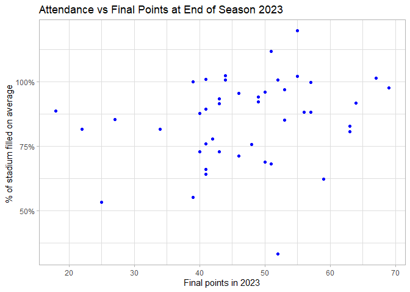
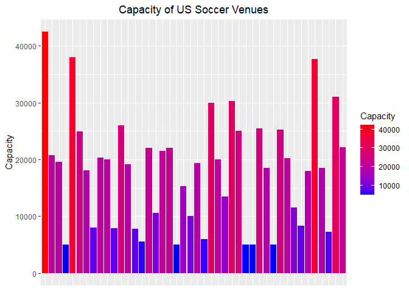

US Soccer Attendance
================
Connor Campbell

- [Introduction](#introduction)
- [Data Collection](#data-collection)
  - [Inputing and Cleaning USL and MLS Attendance
    Data](#inputing-and-cleaning-usl-and-mls-attendance-data)
  - [Inputing and Cleaning USL and MLS Stadium
    Data](#inputing-and-cleaning-usl-and-mls-stadium-data)
  - [Joining both the MLS and USL data
    sets](#joining-both-the-mls-and-usl-data-sets)
- [Adding Extra Data Values for Exploratory and Correlative
  Analysis](#adding-extra-data-values-for-exploratory-and-correlative-analysis)
  - [City and State Values](#city-and-state-values)
  - [2022 Point Values](#2022-point-values)
  - [Governor Raitings](#governor-raitings)
  - [Club Finances](#club-finances)
  - [2023 Point Values](#2023-point-values)
  - [Quick Data Cleaning](#quick-data-cleaning)
- [Exploratoy Plotting and Analysis](#exploratoy-plotting-and-analysis)
- [Regression Analysis](#regression-analysis)
  - [First Model (MLS)](#first-model-mls)
  - [Second Model (MLS) - YOY as Response
    Variable](#second-model-mls---yoy-as-response-variable)
  - [Third Model (USL) - YOY as Response
    Variable](#third-model-usl---yoy-as-response-variable)
- [Conclusions](#conclusions)
- [Appendix](#appendix)

# Introduction

This is an analysis of US professional soccer attendance data. Through
looking at both MLS and USL attendance trends for 2022 and 2023 I am
hoping to come to some insights about what is driving attendance in US
soccer and how the USL and MLS (the two main professional leagues)
compare.

# Data Collection

## Inputing and Cleaning USL and MLS Attendance Data

Utilizing rvest package I scraped data from soccerstadiumdigest.com to
get data for the USL Championship league. I then coerced the imputed
data into a data frame for easier manipulation and renamed a few of the
columns.

``` r
html <- read_html("https://soccerstadiumdigest.com/2023-usl-championship-attendance/")

usl_2023_attendance <- html %>% 
    html_node("table") %>% 
    html_table(
      header = TRUE,
    )

usl_2023_attendance <- as.data.frame(usl_2023_attendance)
usl_2023_attendance <- usl_2023_attendance[,-1]
usl_2023_attendance <- usl_2023_attendance[,-7]
usl_2023_attendance <- usl_2023_attendance[-(24:26),]


usl_2023_attendance <- usl_2023_attendance %>% 
  rename(Average = Av.,
         Games = Gms,
         '2022 Average' = '2022')
```

Following this I then did some quick cleaning to get rid of commas and
convert some of the DF columns into numeric values.

``` r
usl_2023_attendance$Average <- gsub(",","",usl_2023_attendance$Average)
usl_2023_attendance$Totals <- gsub(",","",usl_2023_attendance$Totals)
usl_2023_attendance$`2022 Average` <- gsub(",","",usl_2023_attendance$`2022 Average`)

usl <- usl_2023_attendance %>% 
  mutate_at(c('Average','Totals','2022 Average'), as.numeric)
```

Here is a view of the USL Championships 2023 attendance data.

| Team                   | Average | Totals | Games | 2022 Average |   YOY |
|:-----------------------|--------:|-------:|------:|-------------:|------:|
| Sacramento Republic FC |   10627 | 180665 |    17 |         9876 |  0.08 |
| Louisville City FC     |   10547 | 179299 |    17 |        10465 |  0.01 |
| Indy Eleven            |    9709 | 155349 |    16 |         8285 |  0.17 |
| New Mexico United      |    9619 | 163518 |    17 |        10724 | -0.10 |
| CS Switchbacks FC      |    7753 | 124044 |    16 |         7199 |  0.08 |
| Phoenix Rising FC      |    7409 |  29634 |     4 |         6401 |  0.16 |
| San Antonio FC         |    7325 | 124522 |    17 |         5980 |  0.22 |
| El Paso Locomotive FC  |    6590 | 112038 |    17 |         6517 |  0.01 |
| Detroit City FC        |    6032 | 102544 |    17 |         6118 | -0.01 |
| Tampa Bay Rowdies      |    5984 |  77797 |    13 |         5148 |  0.16 |
| Birmingham Legion FC   |    5091 |  20362 |     4 |         5920 | -0.14 |
| Pittsburgh Riverhounds |    5073 |  76095 |    15 |         3934 |  0.29 |
| Hartford Athletic      |    4882 |  73224 |    15 |         5178 | -0.06 |
| San Diego Loyal        |    4754 |  71309 |    15 |         4519 |  0.05 |
| Rio Grande Valley FC   |    4506 |  72095 |    16 |         4074 |  0.11 |
| Orange County SC       |    4411 |  70568 |    16 |         4230 |  0.04 |
| FC Tulsa               |    4320 |  73443 |    17 |         4044 |  0.07 |
| Monterey Bay FC        |    3963 |  67378 |    17 |         3683 |  0.08 |
| Oakland Roots SC       |    3894 |  66196 |    17 |         4611 | -0.16 |
| Memphis 901 FC         |    3344 |  33439 |    10 |         3683 | -0.09 |
| Charleston Battery     |    3113 |  52919 |    17 |         2797 |  0.11 |
| Loudoun United FC      |    2664 |  45288 |    17 |         1583 |  0.68 |
| Miami FC               |    1432 |  24340 |    17 |         1162 |  0.23 |

Now following the same steps with the 2023 MLS data from
<https://soccerstadiumdigest.com/2023-mls-attendance/> we get this
result.

| Team                | Average | Totals | Games | 2022 Average |   YOY |
|:--------------------|--------:|-------:|------:|-------------:|------:|
| Atlanta United FC   |   47526 | 807947 |    17 |        41116 |  0.16 |
| Charlotte FC        |   35544 | 604246 |    17 |        35260 |  0.01 |
| Seattle Sounders    |   32161 | 546744 |    17 |        33607 | -0.04 |
| Nashville SC        |   28257 | 480370 |    17 |        27554 |  0.03 |
| FC Cincinnati       |   25367 | 431237 |    17 |        22487 |  0.13 |
| Toronto FC          |   25310 | 430263 |    17 |        25423 |  0.00 |
| LA Galaxy           |   24106 | 409794 |    17 |        22841 |  0.06 |
| NE Revolution       |   23940 | 406981 |    17 |        20319 |  0.18 |
| Portland Timbers    |   23103 | 392744 |    17 |        23841 | -0.03 |
| St. Louis SC        |   22423 | 381191 |    17 |           NA |    NA |
| LAFC                |   22155 | 376643 |    17 |        22090 |  0.00 |
| Austin FC           |   20738 | 352546 |    17 |        20738 |  0.00 |
| Orlando City SC     |   20590 | 350023 |    17 |        17261 |  0.19 |
| Columbus Crew       |   20314 | 345338 |    17 |        19237 |  0.06 |
| Minnesota United    |   19568 | 332659 |    17 |        19555 |  0.00 |
| NYC FC              |   19477 | 331109 |    17 |        17180 |  0.13 |
| Real Salt Lake      |   19429 | 330290 |    17 |        20470 | -0.05 |
| Philadelphia Union  |   18907 | 321416 |    17 |        18126 |  0.04 |
| Sporting KC         |   18616 | 316474 |    17 |        18365 |  0.01 |
| SJ Earthquakes      |   18412 | 313003 |    17 |        15260 |  0.21 |
| NY Red Bulls        |   18246 | 310190 |    17 |        17002 |  0.07 |
| FC Dallas           |   18239 | 310065 |    17 |        17469 |  0.04 |
| Chicago Fire        |   18175 | 308975 |    17 |        15848 |  0.15 |
| Inter Miami CF      |   17579 | 281257 |    16 |        12637 |  0.39 |
| CF Montreal         |   17562 | 298556 |    17 |        15905 |  0.10 |
| D.C. United         |   17540 | 298185 |    17 |        16256 |  0.08 |
| Vancouver Whitecaps |   16745 | 284661 |    17 |        16399 |  0.02 |
| Colorado Rapids     |   15409 | 261953 |    17 |        14473 |  0.06 |
| Houston Dynamo      |   15027 | 255465 |    17 |        16426 | -0.09 |

This next step is to prepare the data just imputed for a future join
with stadium data taken from Wikipedia. Some of the team names from the
attendance date originating from soccerstadiumdigest.com do not exactly
match the way the names are presented on Wikipedia. In order to be able
to join the two data sets we essentially need to ‘standardize’ the team
names so they match in both data sets.

``` r
# rename points for join - this is to make joining easier in future
# with other data sets 
usl$Team <- gsub("CS Switchbacks FC", "Colorado Springs Switchbacks FC", usl$Team)

MLS$Team <- gsub("LA Galaxy", "Los Angeles Galaxy", MLS$Team)

MLS$Team <- gsub("St. Louis SC", "St. Louis City SC", MLS$Team)

MLS$Team <- gsub("NE Revolution", "New England Revolution", MLS$Team)

MLS$Team <- gsub("LAFC", "Los Angeles FC", MLS$Team)

MLS$Team <- gsub("NYC FC","New York City FC", MLS$Team)

MLS$Team <- gsub("Sporting KC",
                 "Sporting Kansas City", MLS$Team)
MLS$Team <- gsub("SJ Earthquakes",
                 "San Jose Earthquakes", MLS$Team)
MLS$Team <- gsub("NY Red Bulls",
                 "New York Red Bulls", MLS$Team)
usl$Team <- gsub("Rio Grande Valley FC Toros", "Rio Grande Valley FC",
                 usl$Team)
```

Then, using the rbind function we can combine both the USL and MLS
attendance data frames.

``` r
# join attendance together
leagues_joined <-rbind(usl, MLS)
```

| Team                            | Average | Totals | Games | 2022 Average |   YOY |
|:--------------------------------|--------:|-------:|------:|-------------:|------:|
| Sacramento Republic FC          |   10627 | 180665 |    17 |         9876 |  0.08 |
| Louisville City FC              |   10547 | 179299 |    17 |        10465 |  0.01 |
| Indy Eleven                     |    9709 | 155349 |    16 |         8285 |  0.17 |
| New Mexico United               |    9619 | 163518 |    17 |        10724 | -0.10 |
| Colorado Springs Switchbacks FC |    7753 | 124044 |    16 |         7199 |  0.08 |
| Phoenix Rising FC               |    7409 |  29634 |     4 |         6401 |  0.16 |
| San Antonio FC                  |    7325 | 124522 |    17 |         5980 |  0.22 |
| El Paso Locomotive FC           |    6590 | 112038 |    17 |         6517 |  0.01 |
| Detroit City FC                 |    6032 | 102544 |    17 |         6118 | -0.01 |
| Tampa Bay Rowdies               |    5984 |  77797 |    13 |         5148 |  0.16 |
| Birmingham Legion FC            |    5091 |  20362 |     4 |         5920 | -0.14 |
| Pittsburgh Riverhounds          |    5073 |  76095 |    15 |         3934 |  0.29 |
| Hartford Athletic               |    4882 |  73224 |    15 |         5178 | -0.06 |
| San Diego Loyal                 |    4754 |  71309 |    15 |         4519 |  0.05 |
| Rio Grande Valley FC            |    4506 |  72095 |    16 |         4074 |  0.11 |
| Orange County SC                |    4411 |  70568 |    16 |         4230 |  0.04 |
| FC Tulsa                        |    4320 |  73443 |    17 |         4044 |  0.07 |
| Monterey Bay FC                 |    3963 |  67378 |    17 |         3683 |  0.08 |
| Oakland Roots SC                |    3894 |  66196 |    17 |         4611 | -0.16 |
| Memphis 901 FC                  |    3344 |  33439 |    10 |         3683 | -0.09 |
| Charleston Battery              |    3113 |  52919 |    17 |         2797 |  0.11 |
| Loudoun United FC               |    2664 |  45288 |    17 |         1583 |  0.68 |
| Miami FC                        |    1432 |  24340 |    17 |         1162 |  0.23 |
| Atlanta United FC               |   47526 | 807947 |    17 |        41116 |  0.16 |
| Charlotte FC                    |   35544 | 604246 |    17 |        35260 |  0.01 |
| Seattle Sounders                |   32161 | 546744 |    17 |        33607 | -0.04 |
| Nashville SC                    |   28257 | 480370 |    17 |        27554 |  0.03 |
| FC Cincinnati                   |   25367 | 431237 |    17 |        22487 |  0.13 |
| Toronto FC                      |   25310 | 430263 |    17 |        25423 |  0.00 |
| Los Angeles Galaxy              |   24106 | 409794 |    17 |        22841 |  0.06 |
| New England Revolution          |   23940 | 406981 |    17 |        20319 |  0.18 |
| Portland Timbers                |   23103 | 392744 |    17 |        23841 | -0.03 |
| St. Louis City SC               |   22423 | 381191 |    17 |           NA |    NA |
| Los Angeles FC                  |   22155 | 376643 |    17 |        22090 |  0.00 |
| Austin FC                       |   20738 | 352546 |    17 |        20738 |  0.00 |
| Orlando City SC                 |   20590 | 350023 |    17 |        17261 |  0.19 |
| Columbus Crew                   |   20314 | 345338 |    17 |        19237 |  0.06 |
| Minnesota United                |   19568 | 332659 |    17 |        19555 |  0.00 |
| New York City FC                |   19477 | 331109 |    17 |        17180 |  0.13 |
| Real Salt Lake                  |   19429 | 330290 |    17 |        20470 | -0.05 |
| Philadelphia Union              |   18907 | 321416 |    17 |        18126 |  0.04 |
| Sporting Kansas City            |   18616 | 316474 |    17 |        18365 |  0.01 |
| San Jose Earthquakes            |   18412 | 313003 |    17 |        15260 |  0.21 |
| New York Red Bulls              |   18246 | 310190 |    17 |        17002 |  0.07 |
| FC Dallas                       |   18239 | 310065 |    17 |        17469 |  0.04 |
| Chicago Fire                    |   18175 | 308975 |    17 |        15848 |  0.15 |
| Inter Miami CF                  |   17579 | 281257 |    16 |        12637 |  0.39 |
| CF Montreal                     |   17562 | 298556 |    17 |        15905 |  0.10 |
| D.C. United                     |   17540 | 298185 |    17 |        16256 |  0.08 |
| Vancouver Whitecaps             |   16745 | 284661 |    17 |        16399 |  0.02 |
| Colorado Rapids                 |   15409 | 261953 |    17 |        14473 |  0.06 |
| Houston Dynamo                  |   15027 | 255465 |    17 |        16426 | -0.09 |

## Inputing and Cleaning USL and MLS Stadium Data

Now we are going to input the stadium specific data from Wikipedia.

``` r
htmlstadium <- read_html("https://en.wikipedia.org/wiki/List_of_Major_League_Soccer_stadiums")

stadium_MLS <- htmlstadium %>% 
  html_node("table.wikitable.sortable") %>% 
  html_table(
    header = TRUE,
  )
```

With some quick manipulations.

``` r
stadium_MLS <- stadium_MLS %>%
  select(-c(Image,`Ref(s)`)) 

stadium_MLS$Capacity <- readr::parse_number(stadium_MLS$Capacity)

stadium_MLS$Team <- gsub("LA Galaxy", "Los Angeles Galaxy", stadium_MLS$Team)

stadium_MLS$Team <- gsub("St. Louis SC", "St. Louis City SC", stadium_MLS$Team)

stadium_MLS$Team <- gsub("NE Revolution", "New England Revolution", stadium_MLS$Team)

stadium_MLS$Team <- gsub("LAFC", "Los Angeles FC", stadium_MLS$Team)

stadium_MLS$Team <- gsub("NYC FC","New York City FC", stadium_MLS$Team)

stadium_MLS$Team <- gsub("Sporting KC",
                 "Sporting Kansas City", stadium_MLS$Team)
stadium_MLS$Team <- gsub("SJ Earthquakes",
                 "San Jose Earthquakes", stadium_MLS$Team)
stadium_MLS$Team <- gsub("NY Red Bulls",
                 "New York Red Bulls", stadium_MLS$Team)
```

Giving us this table.

| Stadium                    | Team                         | Location                                                                        | First MLS year in stadium | Capacity | Opened | Surface           | Field dimensions             | Coordinates                                                                                                                                                                                                                                                                                                                                                               | Roof type   | Soccer specific |
|:---------------------------|:-----------------------------|:--------------------------------------------------------------------------------|--------------------------:|---------:|-------:|:------------------|:-----------------------------|:--------------------------------------------------------------------------------------------------------------------------------------------------------------------------------------------------------------------------------------------------------------------------------------------------------------------------------------------------------------------------|:------------|:----------------|
| Allianz Field              | Minnesota United FC          | Saint Paul, Minnesota                                                           |                      2019 |    19400 |   2019 | Grass             | 115 yd × 75 yd(105 m × 69 m) | .mw-parser-output .geo-default,.mw-parser-output .geo-dms,.mw-parser-output .geo-dec{display:inline}.mw-parser-output .geo-nondefault,.mw-parser-output .geo-multi-punct,.mw-parser-output .geo-inline-hidden{display:none}.mw-parser-output .longitude,.mw-parser-output .latitude{white-space:nowrap}44°57′10″N 93°9′54″W / 44.95278°N 93.16500°W / 44.95278; -93.16500 | Open        | Yes             |
| America First Field        | Real Salt Lake               | Sandy, Utah                                                                     |                      2008 |    20213 |   2008 | Grass             | 120 yd × 75 yd(110 m × 69 m) | 40°34′59″N 111°53′35″W / 40.582923°N 111.893156°W / 40.582923; -111.893156 (America First Field)                                                                                                                                                                                                                                                                          | Open        | Yes             |
| Audi Field                 | D.C. United                  | Washington, D.C.                                                                |                      2018 |    20000 |   2018 | Grass             | 115 yd × 75 yd(105 m × 69 m) | 38°52′6″N 77°0′44″W / 38.86833°N 77.01222°W / 38.86833; -77.01222 (Audi Field)                                                                                                                                                                                                                                                                                            | Open        | Yes             |
| Bank of America Stadium    | Charlotte FC                 | Charlotte, North Carolina                                                       |                      2022 |    38000 |   1996 | FieldTurf         | TBA                          | 35°13′33″N 80°51′10″W / 35.22583°N 80.85278°W / 35.22583; -80.85278 (Bank of America Stadium)                                                                                                                                                                                                                                                                             | Open        | No              |
| BC Place ‡                 | Vancouver Whitecaps FC       | Vancouver, British Columbia                                                     |                      2011 |    22120 |   1983 | Polytan           | 117 yd × 75 yd(107 m × 69 m) | 49°16′36″N 123°6′43″W / 49.27667°N 123.11194°W / 49.27667; -123.11194 (BC Place)                                                                                                                                                                                                                                                                                          | Retractable | No              |
| BMO Field                  | Toronto FC                   | Toronto, Ontario                                                                |                      2007 |    30991 |   2007 | Hybrid grass      |                              |                                                                                                                                                                                                                                                                                                                                                                           |             |                 |
| (SISGrass)                 | 115 yd × 74 yd(105 m × 68 m) | 43°37′58″N 79°25′07″W / 43.63278°N 79.41861°W / 43.63278; -79.41861 (BMO Field) |                      Open |      Yes |        |                   |                              |                                                                                                                                                                                                                                                                                                                                                                           |             |                 |
| BMO Stadium                | Los Angeles FC               | Los Angeles, California                                                         |                      2018 |    22000 |   2018 | Grass             | 115 yd × 75 yd(105 m × 69 m) | 34°00′47″N 118°17′6″W / 34.01306°N 118.28500°W / 34.01306; -118.28500 (BMO Stadium)                                                                                                                                                                                                                                                                                       | Open        | Yes             |
| Chase Stadium              | Inter Miami CF               | Fort Lauderdale, Florida                                                        |                      2020 |    21550 |   2020 | Grass             | 115 yd × 75 yd(105 m × 69 m) | 26°11′35″N 80°9′40″W / 26.19306°N 80.16111°W / 26.19306; -80.16111 (DRV PNK Stadium)                                                                                                                                                                                                                                                                                      | Open        | Yes             |
| Children’s Mercy Park      | Sporting Kansas City         | Kansas City, Kansas                                                             |                      2011 |    18467 |   2011 | Grass             | 120 yd × 75 yd(110 m × 69 m) | 39°07′18″N 94°49′25″W / 39.1218°N 94.8237°W / 39.1218; -94.8237 (Children’s Mercy Park)                                                                                                                                                                                                                                                                                   | Open        | Yes             |
| CityPark                   | St. Louis City SC            | St. Louis, Missouri                                                             |                      2023 |    22500 |   2022 | Grass             | 114 yd × 74 yd(104 m × 68 m) | 38°37′51.7″N 90°12′39.3″W / 38.631028°N 90.210917°W / 38.631028; -90.210917 (Citypark)                                                                                                                                                                                                                                                                                    | Open        | Yes             |
| Dick’s Sporting Goods Park | Colorado Rapids              | Commerce City, Colorado                                                         |                      2007 |    18061 |   2007 | Grass             | 120 yd × 75 yd(110 m × 69 m) | 39°48′20″N 104°53′31″W / 39.80556°N 104.89194°W / 39.80556; -104.89194 (Dick’s Sporting Goods Park)                                                                                                                                                                                                                                                                       | Open        | Yes             |
| Dignity Health Sports Park | Los Angeles Galaxy           | Carson, California                                                              |                      2003 |    27000 |   2003 | Grass             | 120 yd × 75 yd(110 m × 69 m) | 33°51′52″N 118°15′40″W / 33.86444°N 118.26111°W / 33.86444; -118.26111 (Dignity Health Sports Park)                                                                                                                                                                                                                                                                       | Open        | Yes             |
| Gillette Stadium           | New England Revolution       | Foxborough, Massachusetts                                                       |                      2002 |    20000 |   2002 | FieldTurf         | 115 yd × 75 yd(105 m × 69 m) | 42°05′27.40″N 71°15′51.64″W / 42.0909444°N 71.2643444°W / 42.0909444; -71.2643444 (Gillette Stadium)                                                                                                                                                                                                                                                                      | Open        | No              |
| Geodis Park                | Nashville SC                 | Nashville, Tennessee                                                            |                      2022 |    30000 |   2022 | Grass             | 120 yd × 75 yd(110 m × 69 m) | 36°7′49″N 86°45′56″W / 36.13028°N 86.76556°W / 36.13028; -86.76556 (Geodis Park)                                                                                                                                                                                                                                                                                          | Open        | Yes             |
| Inter&Co Stadium           | Orlando City SC              | Orlando, Florida                                                                |                      2017 |    25500 |   2017 | Grass             | 120 yd × 75 yd(110 m × 69 m) | 28°37′27.83″N 81°23′20.53″W / 28.6243972°N 81.3890361°W / 28.6243972; -81.3890361 (Exploria Stadium)                                                                                                                                                                                                                                                                      | Open        | Yes             |
| Lower.com Field            | Columbus Crew                | Columbus, Ohio                                                                  |                      2021 |    20371 |   2021 | Grass             | 120 yd × 75 yd(110 m × 69 m) | 39°58′6.46″N 83°1′1.52″W / 39.9684611°N 83.0170889°W / 39.9684611; -83.0170889 (Lower.com Field)                                                                                                                                                                                                                                                                          | Open        | Yes             |
| Lumen Field                | Seattle Sounders FC          | Seattle, Washington                                                             |                      2009 |    37722 |   2002 | FieldTurf         | 114 yd × 74 yd(104 m × 68 m) | 47°35′43″N 122°19′54″W / 47.5952°N 122.3316°W / 47.5952; -122.3316 (Lumen Field)                                                                                                                                                                                                                                                                                          | Open        | No              |
| Mercedes-Benz Stadium ‡    | Atlanta United FC            | Atlanta, Georgia                                                                |                      2017 |    42500 |   2017 | FieldTurf         | 115 yd × 75 yd(105 m × 69 m) | 33°45′19.30″N 84°24′4.29″W / 33.7553611°N 84.4011917°W / 33.7553611; -84.4011917 (Mercedes-Benz Stadium)                                                                                                                                                                                                                                                                  | Retractable | No              |
| PayPal Park                | San Jose Earthquakes         | San Jose, California                                                            |                      2015 |    18000 |   2015 | SISGrass (Hybrid) | 115 yd × 75 yd(105 m × 69 m) | 37°21′5″N 121°55′30″W / 37.35139°N 121.92500°W / 37.35139; -121.92500 (PayPal Park)                                                                                                                                                                                                                                                                                       | Open        | Yes             |
| Providence Park            | Portland Timbers             | Portland, Oregon                                                                |                      2011 |    25218 |   1926 | FieldTurf         | 110 yd × 75 yd(101 m × 69 m) | 45°31′17″N 122°41′30″W / 45.52139°N 122.69167°W / 45.52139; -122.69167 (Providence Park)                                                                                                                                                                                                                                                                                  | Open        | Yes\[note 2\]   |
| Q2 Stadium                 | Austin FC                    | Austin, Texas                                                                   |                      2021 |    20738 |   2021 | Grass             | 115 yd × 75 yd(105 m × 69 m) | 30°23′17.54″N 97°43′11.51″W / 30.3882056°N 97.7198639°W / 30.3882056; -97.7198639 (Q2 Stadium)                                                                                                                                                                                                                                                                            | Open        | Yes             |
| Red Bull Arena             | New York Red Bulls           | Harrison, New Jersey                                                            |                      2010 |    25000 |   2010 | Grass             | 120 yd × 75 yd(110 m × 69 m) | 40°44′12″N 74°9′1″W / 40.73667°N 74.15028°W / 40.73667; -74.15028 (Red Bull Arena)                                                                                                                                                                                                                                                                                        | Open        | Yes             |
| Saputo Stadium             | CF Montréal                  | Montreal, Quebec                                                                |                      2012 |    19619 |   2008 | Grass             | 120 yd × 77 yd(110 m × 70 m) | 45°33′47″N 73°33′9″W / 45.56306°N 73.55250°W / 45.56306; -73.55250 (Saputo Stadium)                                                                                                                                                                                                                                                                                       | Open        | Yes             |
| Shell Energy Stadium       | Houston Dynamo FC            | Houston, Texas                                                                  |                      2012 |    22039 |   2012 | Grass             | 115 yd × 73 yd(105 m × 67 m) | 29°45.132′N 95°21.144′W / 29.752200°N 95.352400°W / 29.752200; -95.352400 (BBVA Stadium)                                                                                                                                                                                                                                                                                  | Open        | Yes             |
| Soldier Field              | Chicago Fire FC              | Chicago, Illinois                                                               |                      1998 |    24955 |   1924 | Grass             | 114 yd × 74 yd(104 m × 68 m) | 41°51′44″N 87°37′00″W / 41.8623°N 87.6167°W / 41.8623; -87.6167 (Soldier Field)                                                                                                                                                                                                                                                                                           | Open        | No              |
| Subaru Park                | Philadelphia Union           | Chester, Pennsylvania                                                           |                      2010 |    18500 |   2010 | Grass             | 120 yd × 75 yd(110 m × 69 m) | 39°49′56″N 75°22′44″W / 39.83222°N 75.37889°W / 39.83222; -75.37889 (Subaru Park)                                                                                                                                                                                                                                                                                         | Open        | Yes             |
| Toyota Stadium             | FC Dallas                    | Frisco, Texas                                                                   |                      2005 |    19096 |   2005 | Grass             | 117 yd × 74 yd(107 m × 68 m) | 33°9′16″N 96°50′7″W / 33.15444°N 96.83528°W / 33.15444; -96.83528 (Toyota Stadium)                                                                                                                                                                                                                                                                                        | Open        | Yes             |
| TQL Stadium                | FC Cincinnati                | Cincinnati, Ohio                                                                |                      2021 |    26000 |   2021 | Hybrid grass      | 110 yd × 75 yd(101 m × 69 m) | 39°06′41″N 84°31′20″W / 39.11139°N 84.52222°W / 39.11139; -84.52222 (TQL Stadium)                                                                                                                                                                                                                                                                                         | Open        | Yes             |
| Yankee Stadium             | New York City FC             | Bronx, New York                                                                 |                      2015 |    30321 |   2009 | Grass             | 110 yd × 70 yd(101 m × 64 m) | 40°49′45″N 73°55′35″W / 40.82917°N 73.92639°W / 40.82917; -73.92639 (Yankee Stadium)                                                                                                                                                                                                                                                                                      | Open        | No              |

The same steps were then taken for the USL Championship stadium data
also taken from Wikipedia:
<https://en.wikipedia.org/wiki/2023_USL_Championship_season>.

The USL data required an extra cleaning due to some stadium names having
“\[A\]” by their names, indicating that the stadium was not
soccer-specific. Removing the \[A\] required the use of the gsub
function and a regular expression.

``` r
html_usl_stadium <- read_html("https://en.wikipedia.org/wiki/2023_USL_Championship_season")

usl_stadium <- html_usl_stadium %>%
  html_node("table.wikitable.sortable") %>%
  html_table(
    header= T
  )
usl_stadium$Capacity <- readr::parse_number(usl_stadium$Capacity)
usl_stadium$Stadium <- gsub("\\Q[A]\\E","",usl_stadium$Stadium)

usl_stadium$Team <- gsub("CS Switchbacks FC", 
                         "Colorado Springs Switchbacks FC", usl_stadium$Team)
usl_stadium$Team <- gsub("Rio Grande Valley FC Toros", "Rio Grande Valley FC",
                 usl_stadium$Team)
```

| Team                            | Stadium                                        | Capacity |
|:--------------------------------|:-----------------------------------------------|---------:|
| Birmingham Legion FC            | Protective Stadium                             |    47000 |
| Charleston Battery              | Patriots Point Soccer Complex                  |     5000 |
| Colorado Springs Switchbacks FC | Weidner Field                                  |     8000 |
| Detroit City FC                 | Keyworth Stadium                               |     7933 |
| FC Tulsa                        | ONEOK Field                                    |     7833 |
| El Paso Locomotive FC           | Southwest University Park                      |     9500 |
| Hartford Athletic               | Trinity Health Stadium                         |     5500 |
| Indy Eleven                     | IU Michael A. Carroll Track & Soccer Stadium   |    10524 |
| Las Vegas Lights FC             | Cashman Field                                  |     9334 |
| Loudoun United FC               | Segra Field                                    |     5000 |
| Louisville City FC              | Lynn Family Stadium                            |    15304 |
| Memphis 901 FC                  | AutoZone Park                                  |    10000 |
| Miami FC                        | Riccardo Silva Stadium                         |    25000 |
| Monterey Bay FC                 | Cardinale Stadium                              |     6000 |
| New Mexico United               | Rio Grande Credit Union Field at Isotopes Park |    13500 |
| Oakland Roots SC                | Pioneer Stadium                                |     5000 |
| Orange County SC                | Championship Soccer Stadium                    |     5000 |
| Phoenix Rising FC               | Phoenix Rising Soccer Stadium                  |    10000 |
| Pittsburgh Riverhounds SC       | Highmark Stadium                               |     5000 |
| Rio Grande Valley FC            | H-E-B Park                                     |     9400 |
| Sacramento Republic FC          | Heart Health Park                              |    11569 |
| San Antonio FC                  | Toyota Field                                   |     8296 |
| San Diego Loyal SC              | Torero Stadium                                 |     6000 |
| Tampa Bay Rowdies               | Al Lang Stadium                                |     7227 |

## Joining both the MLS and USL data sets

For this join I utilized the stringdist_inner_join() function from the
fuzzyjoin library, allowing me to join both the attendance and stadium
data by matching the two tables with the ‘team’ variable. This is why we
went through the trouble of renaming some of team names earlier in the
process.

``` r
# Merge stadium data with leagues data frame
mls_filter <- stadium_MLS %>%
  subset(select = c("Stadium","Team","Capacity"))

stadium_joined <- rbind(mls_filter, usl_stadium)

# joining data for attendance and stadium capacity
leagues_master <- leagues_joined %>%
  stringdist_inner_join(stadium_joined, by ="Team", max_dist = 3) %>%
  select(-Team.y) %>%
  rename(Teams = Team.x)
```

I also created two other columns in the table so we can have insight
into what percentage of the stadium was filled on average for both 2022
and 2023.

``` r
# creation of % filled columns
leagues_master <- leagues_master %>%
  mutate("%_2023_Fill" = (Average/Capacity)) %>%
  mutate("%_2022_Fill" = (leagues_master$`2022 Average`/Capacity))
```

Here is the table with the most recent additions:

| Teams                           | Average | Totals | Games | 2022 Average |   YOY | Stadium                                        | Capacity | %\_2023_Fill | %\_2022_Fill |
|:--------------------------------|--------:|-------:|------:|-------------:|------:|:-----------------------------------------------|---------:|-------------:|-------------:|
| Sacramento Republic FC          |   10627 | 180665 |    17 |         9876 |  0.08 | Heart Health Park                              |    11569 |    0.9185755 |    0.8536606 |
| Louisville City FC              |   10547 | 179299 |    17 |        10465 |  0.01 | Lynn Family Stadium                            |    15304 |    0.6891662 |    0.6838082 |
| Indy Eleven                     |    9709 | 155349 |    16 |         8285 |  0.17 | IU Michael A. Carroll Track & Soccer Stadium   |    10524 |    0.9225580 |    0.7872482 |
| New Mexico United               |    9619 | 163518 |    17 |        10724 | -0.10 | Rio Grande Credit Union Field at Isotopes Park |    13500 |    0.7125185 |    0.7943704 |
| Colorado Springs Switchbacks FC |    7753 | 124044 |    16 |         7199 |  0.08 | Weidner Field                                  |     8000 |    0.9691250 |    0.8998750 |
| Phoenix Rising FC               |    7409 |  29634 |     4 |         6401 |  0.16 | Phoenix Rising Soccer Stadium                  |    10000 |    0.7409000 |    0.6401000 |
| San Antonio FC                  |    7325 | 124522 |    17 |         5980 |  0.22 | Toyota Field                                   |     8296 |    0.8829556 |    0.7208293 |
| El Paso Locomotive FC           |    6590 | 112038 |    17 |         6517 |  0.01 | Southwest University Park                      |     9500 |    0.6936842 |    0.6860000 |
| Detroit City FC                 |    6032 | 102544 |    17 |         6118 | -0.01 | Keyworth Stadium                               |     7933 |    0.7603681 |    0.7712089 |
| Tampa Bay Rowdies               |    5984 |  77797 |    13 |         5148 |  0.16 | Al Lang Stadium                                |     7227 |    0.8280061 |    0.7123288 |
| Birmingham Legion FC            |    5091 |  20362 |     4 |         5920 | -0.14 | Protective Stadium                             |    47000 |    0.1083191 |    0.1259574 |
| Pittsburgh Riverhounds          |    5073 |  76095 |    15 |         3934 |  0.29 | Highmark Stadium                               |     5000 |    1.0146000 |    0.7868000 |
| Hartford Athletic               |    4882 |  73224 |    15 |         5178 | -0.06 | Trinity Health Stadium                         |     5500 |    0.8876364 |    0.9414545 |
| San Diego Loyal                 |    4754 |  71309 |    15 |         4519 |  0.05 | Torero Stadium                                 |     6000 |    0.7923333 |    0.7531667 |
| Rio Grande Valley FC            |    4506 |  72095 |    16 |         4074 |  0.11 | H-E-B Park                                     |     9400 |    0.4793617 |    0.4334043 |
| Orange County SC                |    4411 |  70568 |    16 |         4230 |  0.04 | Championship Soccer Stadium                    |     5000 |    0.8822000 |    0.8460000 |
| FC Tulsa                        |    4320 |  73443 |    17 |         4044 |  0.07 | ONEOK Field                                    |     7833 |    0.5515128 |    0.5162773 |
| Monterey Bay FC                 |    3963 |  67378 |    17 |         3683 |  0.08 | Cardinale Stadium                              |     6000 |    0.6605000 |    0.6138333 |
| Oakland Roots SC                |    3894 |  66196 |    17 |         4611 | -0.16 | Pioneer Stadium                                |     5000 |    0.7788000 |    0.9222000 |
| Memphis 901 FC                  |    3344 |  33439 |    10 |         3683 | -0.09 | AutoZone Park                                  |    10000 |    0.3344000 |    0.3683000 |
| Charleston Battery              |    3113 |  52919 |    17 |         2797 |  0.11 | Patriots Point Soccer Complex                  |     5000 |    0.6226000 |    0.5594000 |
| Loudoun United FC               |    2664 |  45288 |    17 |         1583 |  0.68 | Segra Field                                    |     5000 |    0.5328000 |    0.3166000 |
| Miami FC                        |    1432 |  24340 |    17 |         1162 |  0.23 | Riccardo Silva Stadium                         |    25000 |    0.0572800 |    0.0464800 |
| Atlanta United FC               |   47526 | 807947 |    17 |        41116 |  0.16 | Mercedes-Benz Stadium ‡                        |    42500 |    1.1182588 |    0.9674353 |
| Charlotte FC                    |   35544 | 604246 |    17 |        35260 |  0.01 | Bank of America Stadium                        |    38000 |    0.9353684 |    0.9278947 |
| Seattle Sounders                |   32161 | 546744 |    17 |        33607 | -0.04 | Lumen Field                                    |    37722 |    0.8525794 |    0.8909125 |
| Nashville SC                    |   28257 | 480370 |    17 |        27554 |  0.03 | Geodis Park                                    |    30000 |    0.9419000 |    0.9184667 |
| FC Cincinnati                   |   25367 | 431237 |    17 |        22487 |  0.13 | TQL Stadium                                    |    26000 |    0.9756538 |    0.8648846 |
| Toronto FC                      |   25310 | 430263 |    17 |        25423 |  0.00 | BMO Field                                      |    30991 |    0.8166887 |    0.8203349 |
| Los Angeles Galaxy              |   24106 | 409794 |    17 |        22841 |  0.06 | Dignity Health Sports Park                     |    27000 |    0.8928148 |    0.8459630 |
| New England Revolution          |   23940 | 406981 |    17 |        20319 |  0.18 | Gillette Stadium                               |    20000 |    1.1970000 |    1.0159500 |
| Portland Timbers                |   23103 | 392744 |    17 |        23841 | -0.03 | Providence Park                                |    25218 |    0.9161313 |    0.9453961 |
| St. Louis City SC               |   22423 | 381191 |    17 |           NA |    NA | CityPark                                       |    22500 |    0.9965778 |           NA |
| Los Angeles FC                  |   22155 | 376643 |    17 |        22090 |  0.00 | BMO Stadium                                    |    22000 |    1.0070455 |    1.0040909 |
| Austin FC                       |   20738 | 352546 |    17 |        20738 |  0.00 | Q2 Stadium                                     |    20738 |    1.0000000 |    1.0000000 |
| Orlando City SC                 |   20590 | 350023 |    17 |        17261 |  0.19 | Inter&Co Stadium                               |    25500 |    0.8074510 |    0.6769020 |
| Columbus Crew                   |   20314 | 345338 |    17 |        19237 |  0.06 | Lower.com Field                                |    20371 |    0.9972019 |    0.9443326 |
| Minnesota United                |   19568 | 332659 |    17 |        19555 |  0.00 | Allianz Field                                  |    19400 |    1.0086598 |    1.0079897 |
| New York City FC                |   19477 | 331109 |    17 |        17180 |  0.13 | Yankee Stadium                                 |    30321 |    0.6423601 |    0.5666040 |
| Real Salt Lake                  |   19429 | 330290 |    17 |        20470 | -0.05 | America First Field                            |    20213 |    0.9612131 |    1.0127146 |
| Philadelphia Union              |   18907 | 321416 |    17 |        18126 |  0.04 | Subaru Park                                    |    18500 |    1.0220000 |    0.9797838 |
| Sporting Kansas City            |   18616 | 316474 |    17 |        18365 |  0.01 | Children’s Mercy Park                          |    18467 |    1.0080684 |    0.9944766 |
| San Jose Earthquakes            |   18412 | 313003 |    17 |        15260 |  0.21 | PayPal Park                                    |    18000 |    1.0228889 |    0.8477778 |
| New York Red Bulls              |   18246 | 310190 |    17 |        17002 |  0.07 | Red Bull Arena                                 |    25000 |    0.7298400 |    0.6800800 |
| FC Dallas                       |   18239 | 310065 |    17 |        17469 |  0.04 | Toyota Stadium                                 |    19096 |    0.9551215 |    0.9147989 |
| Chicago Fire                    |   18175 | 308975 |    17 |        15848 |  0.15 | Soldier Field                                  |    24955 |    0.7283110 |    0.6350631 |
| Inter Miami CF                  |   17579 | 281257 |    16 |        12637 |  0.39 | Chase Stadium                                  |    21550 |    0.8157309 |    0.5864037 |
| CF Montreal                     |   17562 | 298556 |    17 |        15905 |  0.10 | Saputo Stadium                                 |    19619 |    0.8951527 |    0.8106937 |
| D.C. United                     |   17540 | 298185 |    17 |        16256 |  0.08 | Audi Field                                     |    20000 |    0.8770000 |    0.8128000 |
| Vancouver Whitecaps             |   16745 | 284661 |    17 |        16399 |  0.02 | BC Place ‡                                     |    22120 |    0.7570072 |    0.7413653 |
| Colorado Rapids                 |   15409 | 261953 |    17 |        14473 |  0.06 | Dick’s Sporting Goods Park                     |    18061 |    0.8531643 |    0.8013399 |
| Houston Dynamo                  |   15027 | 255465 |    17 |        16426 | -0.09 | Shell Energy Stadium                           |    22039 |    0.6818367 |    0.7453151 |

I also made separate data frames for both the MLS and USL. This will
allow us to analyze the leagues separately later on.

``` r
#MLS DF
mls_master <- MLS %>%
  stringdist_inner_join(stadium_MLS, by ="Team", max_dist = 3) %>%
  select(-Team.y) %>%
  rename(Teams = Team.x)
# creation of % filled columns
mls_master <- mls_master %>%
  mutate("%_2023_Fill" = (Average/Capacity)) %>%
  mutate("%_2022_Fill" = (mls_master$`2022 Average`/Capacity))


#USL DF
usl_master <- usl %>%
  stringdist_inner_join(usl_stadium, by ="Team", max_dist = 3) %>%
  select(-Team.y) %>%
  rename(Teams = Team.x)
# creation of % filled columns
usl_master <- usl_master %>%
  mutate("%_2023_Fill" = (Average/Capacity)) %>%
  mutate("%_2022_Fill" = (usl_master$`2022 Average`/Capacity))
```

# Adding Extra Data Values for Exploratory and Correlative Analysis

Two important variables that can provide insight into attendance are
points and financials. Points being the point value of the team at the
end of the season. In professional soccer, teams are awarded 3 points
for a win and 1 point for a draw. Theoretically, teams that have more
points would have higher attendance.

Furthermore, I also hypothesize that there will be a correlation between
the financial valuation of a clubs roster and it’s attendance. Teams
that have higher payrolls and more star players should be able to draw
bigger crowds.

Lastly, I’m also curious about what I call “city moral.” If a city has
happier citizens will they be more likely to support the city’s club,
because in a sense the club represents a city. One way to analyze this
is by using approval ratings of government officials as a measure of
support. Mayoral data is tricky to find so I decided to use Governor
approval ratings. This obviously is not the most effective strategy so
this aspect of the project is really just an extra step.

Let’s now input data for these variables.

## City and State Values

Firstly, I wanted to add in city/state columns for the main data set
that has been created thus far. Having the location date is important
for joining Governor approval ratings with the correct teams.

Like in the past steps I decided to scrape data from the USL
championship Wikipedia page. Because this page has multiple tables I had
to take the extra step of subset a list of the tables from the webpage
in order to retrive the table I needed. This required me to utilize
html_nodes rather then html_node.

``` r
## Adding in city and state data for future analysis ##

html_city_USL <- read_html("https://en.wikipedia.org/wiki/USL_Championship")

usl_city <- html_city_USL %>%
  html_nodes("table.wikitable") %>%
  .[2] %>%
  html_table(header = T)

usl_city <- data.frame(Reduce(rbind, usl_city))

  
# clean table
usl_city<- usl_city[-c(1,14),]
usl_city<- usl_city[,-8]

# separating city and state for USL
usl_city <- separate_wider_delim(usl_city, City, delim = ",", 
                                 names = c("City", "State"))
usl_city <- usl_city %>%
  subset(select = c("Team", "City", "State")) %>%
  rename(Teams = Team)


#adding data to usl specific USL DF
usl_master <- usl_master %>%
  stringdist_inner_join(usl_city, by = "Teams", max_dist = 3) %>%
  select(-Teams.y) %>%
  rename(Teams = Teams.x)
```

Fortunately, my MLS stadium data that was previously retrieved already
had location data. Although I did need to separate the city and state
names into different columns and then add the two variables back into
the MLS master sheet.

``` r
# separating city and state MLS
stadium_MLS <- separate_wider_delim(stadium_MLS, Location, delim = ",",
                                names = c("City", "State"))
stadium_city_mls <- stadium_MLS %>%
  subset(select = c("Team", "City", "State"))%>%
  rename(Teams = Team)

mls_master <- mls_master %>%
  stringdist_inner_join(stadium_city_mls, by = "Teams", max_dist = 3) %>%
  select(-Teams.y) %>%
  rename(Teams = Teams.x)

cities <- rbind(usl_city, stadium_city_mls)


# joining cities with leagues_master DF
leagues_master <- leagues_master %>%
  stringdist_inner_join(cities, by = "Teams", max_dist = 3) %>%
  select(-Teams.y) %>%
  rename(Teams = Teams.x)
```

## 2022 Point Values

Using the same web scraping method as before I utilized data from
footballdatabase.com for the 2022 MLS points values and data from
Wikipedia for the 2022 USL Championship point values.

``` r
##importing team records for MLS and USL then joining into one sheet to join with master ##

#mls
html_MLS_records <- read_html("https://footballdatabase.com/league-scores-tables/united-states-mls-2022")
html_usl_points <- read_html("https://en.wikipedia.org/wiki/2022_USL_Championship_season")

records_MLS <- html_MLS_records %>% 
  html_node("table.table") %>% 
  html_table(
    header = TRUE,
  )

points_MLS <- records_MLS %>%
  select(P, Club) %>%
rename(Teams = Club, '2022 Pts' = P)


#usl
usl_records <- html_usl_points %>%
  html_table(
    header = TRUE
  )

eastern <- purrr::map_dfr(usl_records[5], dplyr::bind_rows)
names(eastern)[2] <- "Teams"
eastern <- eastern %>%
  select(Teams, Pts)

western <- purrr::map_dfr(usl_records[6], dplyr::bind_rows)
names(western)[2] <- "Teams"
western <- western %>%
  select(Teams, Pts)

usl_2022_standings <- rbind(eastern, western) %>%
  rename('2022 Pts' = Pts)

usl_2022_standings$Teams <- gsub("\\Q (C, X)\\E","",usl_2022_standings$Teams)
usl_2022_standings$Teams <- gsub("\\Q Toros\\E"," FC", usl_2022_standings$Teams)

#Removing MLS next pro teams
usl_2022_standings <- usl_2022_standings[- grep("New York Red Bulls II", 
                                                usl_2022_standings$Teams),]
usl_2022_standings <- usl_2022_standings[- grep("Atlanta United 2", 
                                                usl_2022_standings$Teams),]

#joining with both mls and usl masters
usl_master <- usl_master %>%
  stringdist_inner_join(usl_2022_standings, by = "Teams", max_dist = 3)%>%
  select(-Teams.y) %>%
  rename(Teams = Teams.x)

points_MLS$Teams <- gsub("LA Galaxy", "Los Angeles Galaxy", points_MLS$Teams)
mls_master <- mls_master %>%
  stringdist_inner_join(points_MLS, by = "Teams", max_dist = 3)%>%
  select(-Teams.y) %>%
  rename(Teams = Teams.x)


# merging mls and usl points for inner join
Final_standings <- rbind(usl_2022_standings, points_MLS)


# joining final 2022 points with other data 
Final <- leagues_master %>%
  stringdist_inner_join(Final_standings, by = "Teams", max_dist = 3)
Final <- Final[,-13] 
Final <- rename(.data = Final, Teams = Teams.x)
```

Here is the DF with the points variable added.

| Teams                           | Average | Totals | Games | 2022 Average |   YOY | Stadium                                        | Capacity | %\_2023_Fill | %\_2022_Fill | City             | State            | 2022 Pts |
|:--------------------------------|--------:|-------:|------:|-------------:|------:|:-----------------------------------------------|---------:|-------------:|-------------:|:-----------------|:-----------------|---------:|
| Sacramento Republic FC          |   10627 | 180665 |    17 |         9876 |  0.08 | Heart Health Park                              |    11569 |    0.9185755 |    0.8536606 | Sacramento       | California       |       53 |
| Louisville City FC              |   10547 | 179299 |    17 |        10465 |  0.01 | Lynn Family Stadium                            |    15304 |    0.6891662 |    0.6838082 | Louisville       | Kentucky         |       72 |
| Indy Eleven                     |    9709 | 155349 |    16 |         8285 |  0.17 | IU Michael A. Carroll Track & Soccer Stadium   |    10524 |    0.9225580 |    0.7872482 | Indianapolis     | Indiana          |       41 |
| New Mexico United               |    9619 | 163518 |    17 |        10724 | -0.10 | Rio Grande Credit Union Field at Isotopes Park |    13500 |    0.7125185 |    0.7943704 | Albuquerque      | New Mexico       |       51 |
| Colorado Springs Switchbacks FC |    7753 | 124044 |    16 |         7199 |  0.08 | Weidner Field                                  |     8000 |    0.9691250 |    0.8998750 | Colorado Springs | Colorado         |       55 |
| Phoenix Rising FC               |    7409 |  29634 |     4 |         6401 |  0.16 | Phoenix Rising Soccer Stadium                  |    10000 |    0.7409000 |    0.6401000 | Phoenix          | Arizona          |       42 |
| San Antonio FC                  |    7325 | 124522 |    17 |         5980 |  0.22 | Toyota Field                                   |     8296 |    0.8829556 |    0.7208293 | San Antonio      | Texas            |       77 |
| Detroit City FC                 |    6032 | 102544 |    17 |         6118 | -0.01 | Keyworth Stadium                               |     7933 |    0.7603681 |    0.7712089 | Hamtramck        | Michigan         |       54 |
| Tampa Bay Rowdies               |    5984 |  77797 |    13 |         5148 |  0.16 | Al Lang Stadium                                |     7227 |    0.8280061 |    0.7123288 | St. Petersburg   | Florida          |       67 |
| Pittsburgh Riverhounds          |    5073 |  76095 |    15 |         3934 |  0.29 | Highmark Stadium                               |     5000 |    1.0146000 |    0.7868000 | Pittsburgh       | Pennsylvania     |       57 |
| Hartford Athletic               |    4882 |  73224 |    15 |         5178 | -0.06 | Trinity Health Stadium                         |     5500 |    0.8876364 |    0.9414545 | Hartford         | Connecticut      |       36 |
| Orange County SC                |    4411 |  70568 |    16 |         4230 |  0.04 | Championship Soccer Stadium                    |     5000 |    0.8822000 |    0.8460000 | Irvine           | California       |       34 |
| FC Tulsa                        |    4320 |  73443 |    17 |         4044 |  0.07 | ONEOK Field                                    |     7833 |    0.5515128 |    0.5162773 | Tulsa            | Oklahoma         |       42 |
| Monterey Bay FC                 |    3963 |  67378 |    17 |         3683 |  0.08 | Cardinale Stadium                              |     6000 |    0.6605000 |    0.6138333 | Seaside          | California       |       40 |
| Oakland Roots SC                |    3894 |  66196 |    17 |         4611 | -0.16 | Pioneer Stadium                                |     5000 |    0.7788000 |    0.9222000 | Oakland          | California       |       46 |
| Memphis 901 FC                  |    3344 |  33439 |    10 |         3683 | -0.09 | AutoZone Park                                  |    10000 |    0.3344000 |    0.3683000 | Memphis          | Tennessee        |       68 |
| Charleston Battery              |    3113 |  52919 |    17 |         2797 |  0.11 | Patriots Point Soccer Complex                  |     5000 |    0.6226000 |    0.5594000 | Mount Pleasant   | South Carolina   |       25 |
| Loudoun United FC               |    2664 |  45288 |    17 |         1583 |  0.68 | Segra Field                                    |     5000 |    0.5328000 |    0.3166000 | Leesburg         | Virginia         |       28 |
| Miami FC                        |    1432 |  24340 |    17 |         1162 |  0.23 | Riccardo Silva Stadium                         |    25000 |    0.0572800 |    0.0464800 | University Park  | Florida          |       55 |
| Atlanta United FC               |   47526 | 807947 |    17 |        41116 |  0.16 | Mercedes-Benz Stadium ‡                        |    42500 |    1.1182588 |    0.9674353 | Atlanta          | Georgia          |       40 |
| Charlotte FC                    |   35544 | 604246 |    17 |        35260 |  0.01 | Bank of America Stadium                        |    38000 |    0.9353684 |    0.9278947 | Charlotte        | North Carolina   |       42 |
| Seattle Sounders                |   32161 | 546744 |    17 |        33607 | -0.04 | Lumen Field                                    |    37722 |    0.8525794 |    0.8909125 | Seattle          | Washington       |       41 |
| Nashville SC                    |   28257 | 480370 |    17 |        27554 |  0.03 | Geodis Park                                    |    30000 |    0.9419000 |    0.9184667 | Nashville        | Tennessee        |       50 |
| FC Cincinnati                   |   25367 | 431237 |    17 |        22487 |  0.13 | TQL Stadium                                    |    26000 |    0.9756538 |    0.8648846 | Cincinnati       | Ohio             |       49 |
| Toronto FC                      |   25310 | 430263 |    17 |        25423 |  0.00 | BMO Field                                      |    30991 |    0.8166887 |    0.8203349 | Toronto          | Ontario          |       34 |
| Los Angeles Galaxy              |   24106 | 409794 |    17 |        22841 |  0.06 | Dignity Health Sports Park                     |    27000 |    0.8928148 |    0.8459630 | Carson           | California       |       50 |
| New England Revolution          |   23940 | 406981 |    17 |        20319 |  0.18 | Gillette Stadium                               |    20000 |    1.1970000 |    1.0159500 | Foxborough       | Massachusetts    |       42 |
| Portland Timbers                |   23103 | 392744 |    17 |        23841 | -0.03 | Providence Park                                |    25218 |    0.9161313 |    0.9453961 | Portland         | Oregon           |       46 |
| Los Angeles FC                  |   22155 | 376643 |    17 |        22090 |  0.00 | BMO Stadium                                    |    22000 |    1.0070455 |    1.0040909 | Los Angeles      | California       |       67 |
| Austin FC                       |   20738 | 352546 |    17 |        20738 |  0.00 | Q2 Stadium                                     |    20738 |    1.0000000 |    1.0000000 | Austin           | Texas            |       56 |
| Orlando City SC                 |   20590 | 350023 |    17 |        17261 |  0.19 | Inter&Co Stadium                               |    25500 |    0.8074510 |    0.6769020 | Orlando          | Florida          |       48 |
| Columbus Crew                   |   20314 | 345338 |    17 |        19237 |  0.06 | Lower.com Field                                |    20371 |    0.9972019 |    0.9443326 | Columbus         | Ohio             |       46 |
| Minnesota United                |   19568 | 332659 |    17 |        19555 |  0.00 | Allianz Field                                  |    19400 |    1.0086598 |    1.0079897 | Saint Paul       | Minnesota        |       48 |
| New York City FC                |   19477 | 331109 |    17 |        17180 |  0.13 | Yankee Stadium                                 |    30321 |    0.6423601 |    0.5666040 | Bronx            | New York         |       55 |
| Real Salt Lake                  |   19429 | 330290 |    17 |        20470 | -0.05 | America First Field                            |    20213 |    0.9612131 |    1.0127146 | Sandy            | Utah             |       47 |
| Philadelphia Union              |   18907 | 321416 |    17 |        18126 |  0.04 | Subaru Park                                    |    18500 |    1.0220000 |    0.9797838 | Chester          | Pennsylvania     |       67 |
| Sporting Kansas City            |   18616 | 316474 |    17 |        18365 |  0.01 | Children’s Mercy Park                          |    18467 |    1.0080684 |    0.9944766 | Kansas City      | Kansas           |       40 |
| San Jose Earthquakes            |   18412 | 313003 |    17 |        15260 |  0.21 | PayPal Park                                    |    18000 |    1.0228889 |    0.8477778 | San Jose         | California       |       35 |
| New York Red Bulls              |   18246 | 310190 |    17 |        17002 |  0.07 | Red Bull Arena                                 |    25000 |    0.7298400 |    0.6800800 | Harrison         | New Jersey       |       53 |
| FC Dallas                       |   18239 | 310065 |    17 |        17469 |  0.04 | Toyota Stadium                                 |    19096 |    0.9551215 |    0.9147989 | Frisco           | Texas            |       53 |
| Chicago Fire                    |   18175 | 308975 |    17 |        15848 |  0.15 | Soldier Field                                  |    24955 |    0.7283110 |    0.6350631 | Chicago          | Illinois         |       39 |
| Inter Miami CF                  |   17579 | 281257 |    16 |        12637 |  0.39 | Chase Stadium                                  |    21550 |    0.8157309 |    0.5864037 | Fort Lauderdale  | Florida          |       48 |
| CF Montreal                     |   17562 | 298556 |    17 |        15905 |  0.10 | Saputo Stadium                                 |    19619 |    0.8951527 |    0.8106937 | Montreal         | Quebec           |       65 |
| D.C. United                     |   17540 | 298185 |    17 |        16256 |  0.08 | Audi Field                                     |    20000 |    0.8770000 |    0.8128000 | Washington       | D.C.             |       27 |
| Vancouver Whitecaps             |   16745 | 284661 |    17 |        16399 |  0.02 | BC Place ‡                                     |    22120 |    0.7570072 |    0.7413653 | Vancouver        | British Columbia |       43 |
| Colorado Rapids                 |   15409 | 261953 |    17 |        14473 |  0.06 | Dick’s Sporting Goods Park                     |    18061 |    0.8531643 |    0.8013399 | Commerce City    | Colorado         |       43 |
| Houston Dynamo                  |   15027 | 255465 |    17 |        16426 | -0.09 | Shell Energy Stadium                           |    22039 |    0.6818367 |    0.7453151 | Houston          | Texas            |       36 |

## Governor Raitings

Here is the Governor rating data taken from Morning Consult Pro. This
data was then added to the main data frame.

| period_start | period_end | State          | Governor               | demo              |     n | Margin of error | Approve | Dissaprove | Don’t know/No opinion |
|:-------------|:-----------|:---------------|:-----------------------|:------------------|------:|:----------------|:--------|:-----------|:----------------------|
| 4/1/2023     | 6/30/2023  | Alabama        | Kay Ivey               | Registered Voters |  4422 | 1%              | 62%     | 32%        | 6%                    |
| 4/1/2023     | 6/30/2023  | Alaska         | Michael Dunleavy       | Registered Voters |   380 | 5%              | 62%     | 28%        | 10%                   |
| 4/1/2023     | 6/30/2023  | Arizona        | Katie Hobbs            | Registered Voters |  5225 | 1%              | 47%     | 40%        | 13%                   |
| 4/1/2023     | 6/30/2023  | Arkansas       | Sarah Huckabee Sanders | Registered Voters |  2541 | 2%              | 60%     | 30%        | 10%                   |
| 4/1/2023     | 6/30/2023  | California     | Gavin Newsom           | Registered Voters | 20247 | 1%              | 56%     | 37%        | 6%                    |
| 4/1/2023     | 6/30/2023  | Colorado       | Jared Polis            | Registered Voters |  3408 | 2%              | 60%     | 32%        | 8%                    |
| 4/1/2023     | 6/30/2023  | Connecticut    | Ned Lamont             | Registered Voters |  3307 | 2%              | 62%     | 32%        | 6%                    |
| 4/1/2023     | 6/30/2023  | Delaware       | John Carney            | Registered Voters |  1161 | 3%              | 55%     | 32%        | 13%                   |
| 4/1/2023     | 6/30/2023  | Florida        | Ron DeSantis           | Registered Voters | 22556 | 1%              | 54%     | 42%        | 4%                    |
| 4/1/2023     | 6/30/2023  | Georgia        | Brian Kemp             | Registered Voters | 10176 | 1%              | 59%     | 33%        | 8%                    |
| 4/1/2023     | 6/30/2023  | Hawaii         | Josh Green             | Registered Voters |   720 | 4%              | 64%     | 24%        | 12%                   |
| 4/1/2023     | 6/30/2023  | Idaho          | Brad Little            | Registered Voters |   838 | 3%              | 54%     | 38%        | 8%                    |
| 4/1/2023     | 6/30/2023  | Illinois       | JB Pritzker            | Registered Voters | 11054 | 1%              | 54%     | 41%        | 5%                    |
| 4/1/2023     | 6/30/2023  | Indiana        | Eric Holcomb           | Registered Voters |  5854 | 1%              | 55%     | 35%        | 10%                   |
| 4/1/2023     | 6/30/2023  | Iowa           | Kim Reynolds           | Registered Voters |  2400 | 2%              | 54%     | 42%        | 4%                    |
| 4/1/2023     | 6/30/2023  | Kansas         | Laura Kelly            | Registered Voters |  2122 | 2%              | 58%     | 34%        | 7%                    |
| 4/1/2023     | 6/30/2023  | Kentucky       | Andy Beshear           | Registered Voters |  4921 | 1%              | 64%     | 32%        | 5%                    |
| 4/1/2023     | 6/30/2023  | Louisiana      | John Bel Edwards       | Registered Voters |  3426 | 2%              | 53%     | 39%        | 8%                    |
| 4/1/2023     | 6/30/2023  | Maine          | Janet Mills            | Registered Voters |  1350 | 3%              | 59%     | 39%        | 3%                    |
| 4/1/2023     | 6/30/2023  | Maryland       | Wes Moore              | Registered Voters |  4779 | 1%              | 58%     | 22%        | 20%                   |
| 4/1/2023     | 6/30/2023  | Massachusetts  | Maura Healey           | Registered Voters |  5138 | 1%              | 60%     | 23%        | 17%                   |
| 4/1/2023     | 6/30/2023  | Michigan       | Gretchen Whitmer       | Registered Voters |  9975 | 1%              | 57%     | 39%        | 4%                    |
| 4/1/2023     | 6/30/2023  | Minnesota      | Tim Walz               | Registered Voters |  4008 | 2%              | 54%     | 42%        | 4%                    |
| 4/1/2023     | 6/30/2023  | Mississippi    | Tate Reeves            | Registered Voters |  2380 | 2%              | 48%     | 42%        | 11%                   |
| 4/1/2023     | 6/30/2023  | Missouri       | Mike Parson            | Registered Voters |  5166 | 1%              | 51%     | 36%        | 13%                   |
| 4/1/2023     | 6/30/2023  | Montana        | Greg Gianforte         | Registered Voters |   619 | 4%              | 57%     | 33%        | 10%                   |
| 4/1/2023     | 6/30/2023  | Nebraska       | Jim Pillen             | Registered Voters |  1314 | 3%              | 51%     | 29%        | 20%                   |
| 4/1/2023     | 6/30/2023  | Nevada         | Joseph Lombardo        | Registered Voters |  2863 | 2%              | 57%     | 26%        | 17%                   |
| 4/1/2023     | 6/30/2023  | New Hampshire  | Chris Sununu           | Registered Voters |  1372 | 3%              | 64%     | 29%        | 7%                    |
| 4/1/2023     | 6/30/2023  | New Jersey     | Philip Murphy          | Registered Voters |  7732 | 1%              | 55%     | 37%        | 8%                    |
| 4/1/2023     | 6/30/2023  | New Mexico     | Michelle Lujan Grisham | Registered Voters |  1155 | 3%              | 52%     | 42%        | 6%                    |
| 4/1/2023     | 6/30/2023  | New York       | Kathy Hochul           | Registered Voters | 19856 | 1%              | 51%     | 40%        | 9%                    |
| 4/1/2023     | 6/30/2023  | North Carolina | Roy Cooper III         | Registered Voters |  9906 | 1%              | 54%     | 36%        | 10%                   |
| 4/1/2023     | 6/30/2023  | North Dakota   | Doug Burgum            | Registered Voters |   470 | 5%              | 57%     | 27%        | 16%                   |
| 4/1/2023     | 6/30/2023  | Ohio           | Mike DeWine            | Registered Voters | 11851 | 1%              | 57%     | 36%        | 7%                    |
| 4/1/2023     | 6/30/2023  | Oklahoma       | Kevin Stitt            | Registered Voters |  3180 | 2%              | 51%     | 40%        | 9%                    |
| 4/1/2023     | 6/30/2023  | Oregon         | Tina Kotek             | Registered Voters |  2644 | 2%              | 45%     | 39%        | 16%                   |
| 4/1/2023     | 6/30/2023  | Pennsylvania   | Josh Shapiro           | Registered Voters | 14599 | 1%              | 56%     | 28%        | 17%                   |
| 4/1/2023     | 6/30/2023  | Rhode Island   | Dan McKee              | Registered Voters |  1018 | 3%              | 52%     | 33%        | 15%                   |
| 4/1/2023     | 6/30/2023  | South Carolina | Henry McMaster         | Registered Voters |  5347 | 1%              | 56%     | 33%        | 11%                   |
| 4/1/2023     | 6/30/2023  | South Dakota   | Kristi Noem            | Registered Voters |   599 | 4%              | 63%     | 35%        | 2%                    |
| 4/1/2023     | 6/30/2023  | Tennessee      | Bill Lee               | Registered Voters |  5997 | 1%              | 59%     | 32%        | 9%                    |
| 4/1/2023     | 6/30/2023  | Texas          | Gregory Abbott         | Registered Voters | 19050 | 1%              | 53%     | 42%        | 5%                    |
| 4/1/2023     | 6/30/2023  | Utah           | Spencer Cox            | Registered Voters |  1487 | 3%              | 61%     | 26%        | 13%                   |
| 4/1/2023     | 6/30/2023  | Vermont        | Phil Scott             | Registered Voters |   513 | 4%              | 76%     | 22%        | 2%                    |
| 4/1/2023     | 6/30/2023  | Virginia       | Glenn Youngkin         | Registered Voters |  8123 | 1%              | 57%     | 32%        | 11%                   |
| 4/1/2023     | 6/30/2023  | Washington     | Jay Inslee             | Registered Voters |  4239 | 2%              | 51%     | 43%        | 6%                    |
| 4/1/2023     | 6/30/2023  | West Virginia  | Jim Justice            | Registered Voters |  2112 | 2%              | 62%     | 33%        | 5%                    |
| 4/1/2023     | 6/30/2023  | Wisconsin      | Tony Evers             | Registered Voters |  4949 | 1%              | 51%     | 44%        | 5%                    |
| 4/1/2023     | 6/30/2023  | Wyoming        | Mark Gordon            | Registered Voters |   285 | 6%              | 69%     | 19%        | 11%                   |

## Club Finances

This club finance data comes from <https://www.transfermarkt.com> and is
current as of October 11, 2023. So, towards the end of the 2023 season.

``` r
## loading in club finances (in millions of euros)
finances <- read_xlsx(here("data", "Club Market Values.xlsx"), sheet = "Values")
finances$`Market Value`<- parse_number(finances$`Market Value`)
finances$`Total market value`<- parse_number(finances$`Total market value`)

#joining data
Final <- Final %>%
  stringdist_inner_join(finances, by = "Teams", max_dist = 3)%>%
  select(-Teams.y) %>%
  rename(Teams = Teams.x)


#joining finance with usl master
finances_usl <- read_xlsx(here("Data", "Club Market Values.xlsx"), sheet = "USL")
finances_usl$`Market Value`<- parse_number(finances_usl$`Market Value`)
finances_usl$`Total market value`<- parse_number(finances_usl$`Total market value`)
usl_master <- usl_master %>%
  stringdist_inner_join(finances_usl, by = "Teams", max_dist = 3)%>%
  select(-Teams.y) %>%
  rename(Teams = Teams.x)

#joining finance with mls master
finances_mls <- read_xlsx(here("Data", "Club Market Values.xlsx"), sheet = "MLS")
finances_mls$`Market Value`<- parse_number(finances_mls$`Market Value`)
finances_mls$`Total market value`<- parse_number(finances_mls$`Total market value`)
mls_master <- mls_master %>%
  stringdist_inner_join(finances_mls, by = "Teams", max_dist = 3)%>%
  select(-Teams.y) %>%
  rename(Teams = Teams.x)
```

## 2023 Point Values

In addition to the 2022 point records I also wanted to include the data
from 2023 for comparison and analysis. This data was importated from a
spreadsheet and joined with the main data set like the past steps in
this process.

With both the 2022 values and 2023 values I created a new column in the
data frame for the percentage change in values from 2022 to 2023.

``` r
# calculating new column based on percentage increase in Pts from 2022 to 2023
  
Final <- Final %>% 
  mutate("Pts_change_yoy" = ((`Pts 2023` -`2022 Pts`)/ `2022 Pts`) * 100)

mls_master <- mls_master %>%
  mutate("Pts_change_yoy" = ((`Pts 2023` -`2022 Pts`)/ `2022 Pts`) * 100)

usl_master <- usl_master %>%
  mutate("Pts_change_yoy" = ((`Pts 2023` -`2022 Pts`)/ `2022 Pts`) * 100)
```

## Quick Data Cleaning

After imputing these explanatory variables I then removed data that
skewed the data. For example one USL teams only had 4 home games, unlike
other teams which played 10 or more games.

``` r
## cleaning - phoenix and Birmingham only have four games
# number of games are too low
usl_master %>%
  group_by(Games) %>%
  arrange(Games)
```

    ## # A tibble: 19 × 20
    ## # Groups:   Games [6]
    ##    Teams              Average Totals Games `2022 Average`   YOY Stadium Capacity
    ##    <chr>                <dbl>  <dbl> <int>          <dbl> <dbl> <chr>      <dbl>
    ##  1 Phoenix Rising FC     7409  29634     4           6401  0.16 Phoeni…    10000
    ##  2 Memphis 901 FC        3344  33439    10           3683 -0.09 AutoZo…    10000
    ##  3 Tampa Bay Rowdies     5984  77797    13           5148  0.16 Al Lan…     7227
    ##  4 Pittsburgh Riverh…    5073  76095    15           3934  0.29 Highma…     5000
    ##  5 Hartford Athletic     4882  73224    15           5178 -0.06 Trinit…     5500
    ##  6 Indy Eleven           9709 155349    16           8285  0.17 IU Mic…    10524
    ##  7 Colorado Springs …    7753 124044    16           7199  0.08 Weidne…     8000
    ##  8 Orange County SC      4411  70568    16           4230  0.04 Champi…     5000
    ##  9 Sacramento Republ…   10627 180665    17           9876  0.08 Heart …    11569
    ## 10 Louisville City FC   10547 179299    17          10465  0.01 Lynn F…    15304
    ## 11 New Mexico United     9619 163518    17          10724 -0.1  Rio Gr…    13500
    ## 12 San Antonio FC        7325 124522    17           5980  0.22 Toyota…     8296
    ## 13 Detroit City FC       6032 102544    17           6118 -0.01 Keywor…     7933
    ## 14 FC Tulsa              4320  73443    17           4044  0.07 ONEOK …     7833
    ## 15 Monterey Bay FC       3963  67378    17           3683  0.08 Cardin…     6000
    ## 16 Oakland Roots SC      3894  66196    17           4611 -0.16 Pionee…     5000
    ## 17 Charleston Battery    3113  52919    17           2797  0.11 Patrio…     5000
    ## 18 Loudoun United FC     2664  45288    17           1583  0.68 Segra …     5000
    ## 19 Miami FC              1432  24340    17           1162  0.23 Riccar…    25000
    ## # ℹ 12 more variables: `%_2023_Fill` <dbl>, `%_2022_Fill` <dbl>, City <chr>,
    ## #   State <chr>, `2022 Pts` <int>, Squad <dbl>, Age <dbl>, Foreigners <dbl>,
    ## #   `Market Value` <dbl>, `Total market value` <dbl>, `Pts 2023` <dbl>,
    ## #   Pts_change_yoy <dbl>

``` r
usl_master <- usl_master %>% 
  filter(Games >= 10)
Final <- Final %>%
  filter(Games >=10 )


# capacity skews attendance percentage
Final %>%
  filter(`%_2023_Fill`< .10) %>%
  select(Teams, Capacity)
```

    ##      Teams Capacity
    ## 1 Miami FC    25000

``` r
# Miami FC is an outlier and this makes sense given their capacity

Final <- Final %>%
  filter(`%_2023_Fill`> .10)
```

# Exploratoy Plotting and Analysis

<!-- -->

An initial plot of attendance (as a percentage of the stadium filled)
versus the 2022 point values of the various teams across all leagues
does not provide any visual correlation.

Lets look at 2023.

<!-- -->

Much of the same result.

<!-- -->

Looking as the capacity of stadiums across both leagues we see a wide
difference in size.

``` r
summary(Final$Capacity)
```

    ##    Min. 1st Qu.  Median    Mean 3rd Qu.    Max. 
    ##    5000    8222   19248   18024   22829   42500

Maybe the capacity of the stadium has some kind of effect on the ability
for teams to fill the stadium?

<!-- -->

There does appear to be a slight trend that bigger stadiums are actually
more well filled. Perhaps because clubs with bigger stadiums are more
well established and popular.

Looking at governor support versus attendance there does not appear to
be any real correlation between the two variables.

<!-- -->

    ## `geom_smooth()` using formula = 'y ~ x'

<!-- -->

This plot of attendance versus market value indicates that there is
potentially a correlation between the two variables.

However, the USL data does not indicate the same correlation.

<!-- -->

This chart below illustrates the stark differences between the two
leagues. All the USL teams have a significantly lower value and little
difference between the size of values.

<!-- -->

Looking further at the relation between season-ending point values and
Attendance. We can see that there is potentially some correlation within
the MLS data set for the 2023 season.

<!-- -->

R can confirm this with the cor function,

``` r
cor(mls_master$`Pts 2023`, mls_master$`%_2023_Fill`)
```

    ## [1] 0.3050948

# Regression Analysis

Using the prior exploratory analysis as a guide it appears that there
are potentially some correlative relationships between attendance rates
and market valuations, as well as season-ending point values.

## First Model (MLS)

``` r
#MLS models
# removing the Messi effect inflating market value with filter
model_mls <- lm(`%_2023_Fill` ~ `Total market value`,mls_master %>% 
                  filter(`Total market value` < 70))
summary(model_mls)
```

    ## 
    ## Call:
    ## lm(formula = `%_2023_Fill` ~ `Total market value`, data = mls_master %>% 
    ##     filter(`Total market value` < 70))
    ## 
    ## Residuals:
    ##      Min       1Q   Median       3Q      Max 
    ## -0.31603 -0.09119  0.02722  0.06908  0.26844 
    ## 
    ## Coefficients:
    ##                      Estimate Std. Error t value Pr(>|t|)    
    ## (Intercept)          0.642120   0.120724   5.319 1.86e-05 ***
    ## `Total market value` 0.006389   0.002802   2.281   0.0317 *  
    ## ---
    ## Signif. codes:  0 '***' 0.001 '**' 0.01 '*' 0.05 '.' 0.1 ' ' 1
    ## 
    ## Residual standard error: 0.1235 on 24 degrees of freedom
    ## Multiple R-squared:  0.1781, Adjusted R-squared:  0.1439 
    ## F-statistic: 5.201 on 1 and 24 DF,  p-value: 0.03174

This first model does indicate a some relationship between Total Market
Value and % of the stadium filled in 2023 for the MLS data set. Although
the adjusted R-squared on 0.14 indicates weak correlation.

## Second Model (MLS) - YOY as Response Variable

However, a model which incorporates year-over-year attendance rate as
the response variable and the 2022 season ending point and total market
value as the explanatory variables offers a stronger fit.

``` r
# change in response variable to YOY changes in attendance
model_mls2 <- lm(`YOY` ~ `2022 Pts` + `Total market value`, mls_master)
summary(model_mls2)
```

    ## 
    ## Call:
    ## lm(formula = YOY ~ `2022 Pts` + `Total market value`, data = mls_master)
    ## 
    ## Residuals:
    ##      Min       1Q   Median       3Q      Max 
    ## -0.14638 -0.04498 -0.02992  0.05224  0.15353 
    ## 
    ## Coefficients:
    ##                       Estimate Std. Error t value Pr(>|t|)    
    ## (Intercept)          -0.059109   0.087614  -0.675 0.506341    
    ## `2022 Pts`           -0.002063   0.001730  -1.192 0.244934    
    ## `Total market value`  0.005088   0.001327   3.833 0.000802 ***
    ## ---
    ## Signif. codes:  0 '***' 0.001 '**' 0.01 '*' 0.05 '.' 0.1 ' ' 1
    ## 
    ## Residual standard error: 0.0829 on 24 degrees of freedom
    ## Multiple R-squared:  0.3803, Adjusted R-squared:  0.3286 
    ## F-statistic: 7.363 on 2 and 24 DF,  p-value: 0.00321

The Adjusted R-squared of 0.3286 is a much stronger fit and Total Market
Value has a high level of significance.

## Third Model (USL) - YOY as Response Variable

The same model as above, except it utilizes USL data, indicates the same
relationship and fit as the model utilizing MLS data.

``` r
model_usl2 <- lm(`YOY` ~ `2022 Pts` + `Total market value`, mls_master)
summary(model_usl2)
```

    ## 
    ## Call:
    ## lm(formula = YOY ~ `2022 Pts` + `Total market value`, data = mls_master)
    ## 
    ## Residuals:
    ##      Min       1Q   Median       3Q      Max 
    ## -0.14638 -0.04498 -0.02992  0.05224  0.15353 
    ## 
    ## Coefficients:
    ##                       Estimate Std. Error t value Pr(>|t|)    
    ## (Intercept)          -0.059109   0.087614  -0.675 0.506341    
    ## `2022 Pts`           -0.002063   0.001730  -1.192 0.244934    
    ## `Total market value`  0.005088   0.001327   3.833 0.000802 ***
    ## ---
    ## Signif. codes:  0 '***' 0.001 '**' 0.01 '*' 0.05 '.' 0.1 ' ' 1
    ## 
    ## Residual standard error: 0.0829 on 24 degrees of freedom
    ## Multiple R-squared:  0.3803, Adjusted R-squared:  0.3286 
    ## F-statistic: 7.363 on 2 and 24 DF,  p-value: 0.00321

# Conclusions

- Correlation between market value and attendance. Higher market value
  correlates with better attendance year-over-year, controlling for the
  overall success of the team (measured by standings points).

- Governor approval does not appear to be correlated with sport
  attendance.

- Stadium size is not a primary driver of attendance.

- Future investigations might look at median income and overall
  population size.

# Appendix

A look at the data at a regional level.

<!-- -->

A quick look at the data indicates that the Midwest and the Northeast
show the most consistent support.
